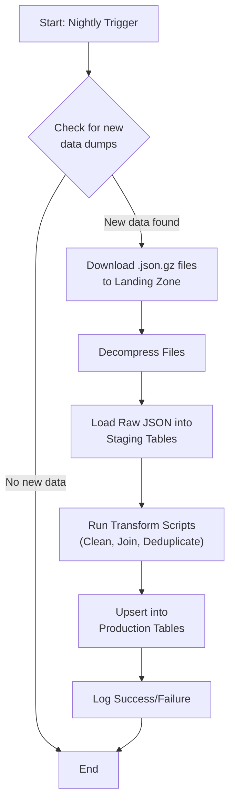

# Data Pipeline Strategy

This document outlines the strategies, challenges, and best practices for creating and maintaining the project's database, as envisioned in the V2.1+ roadmap.

## 1. Recommended Strategy: The ETL Pipeline

The recommended approach is to create an **ETL (Extract, Transform, Load)** pipeline. This breaks the complex process of managing community data into manageable, automated steps.

1.  **Extract: Download Raw Data**
    *   An automated script (Python is recommended for this) will periodically check data source websites (EDSM, Spansh) for new data dumps.
    *   It will download the compressed files (`.json.gz`) to a local "landing" or "raw files" directory. This script's sole responsibility is to fetch the latest raw data.

2.  **Transform & Load: Use a Staging Area**
    *   **Load to Staging Tables:** Instead of loading directly into the final, clean tables, the raw JSON data is first loaded into "staging" tables in the database. These tables should closely mirror the messy, nested structure of the source JSON files. This creates a durable, queryable copy of the source data before any transformations are applied.
    *   **Transform and Clean:** A series of SQL queries or a separate script reads from the staging tables. This is where the main logic resides:
        *   Clean data (e.g., standardize text, handle null values).
        *   De-duplicate records based on primary keys.
        *   Enrich data by joining information from multiple sources (e.g., adding region data to the EDSM system data).
        *   Structure the data to fit the final, "production" schema (e.g., `systems`, `bodies`, `stations` tables).
    *   **Insert into Production Tables:** Use an `INSERT ... ON CONFLICT DO UPDATE` (in PostgreSQL) or a `MERGE` command to safely update the production tables with the cleaned data. This makes the script **idempotent**—it can be run repeatedly without creating duplicates or errors.

## 2. Pipeline Flowchart

The following flowchart visualizes the recommended ETL process.

## 3. What NOT to Implement (Anti-Patterns to Avoid)

*   **Don't write a monolithic script.** A single script that downloads, unzips, parses, and loads in one step is brittle. If it fails, the entire process must be restarted. A modular, step-by-step pipeline is more robust.
*   **Don't load directly into production tables.** The staging area acts as a crucial safety buffer. If a data dump is released with a new format or contains corrupted data, it will only break the initial staging load, protecting the integrity of your final tables.
*   **Don't load massive files entirely into memory.** Use a streaming JSON parser (like Python's `ijson` library) to read multi-gigabyte files one object at a time. This keeps memory usage low and is essential for handling large datasets.
*   **Don't trust system names for joins.** Always use `id64` as the primary key for joining system data from different sources. System names can have variations that will cause joins to fail.

## 4. Challenges and Precautions

*   **Schema Drift:** The community data sources may change their file formats without warning. Parsing code must be resilient to these changes. The pipeline should log errors when an expected field is missing and have a clear plan for adaptation.
*   **Data Volume:** Full galaxy data dumps are enormous. The database loading process should use bulk-loading tools (like PostgreSQL's `COPY` command), which are much more efficient than single `INSERT` statements in a loop.
*   **Rate Limiting:** If supplementing data with live API calls (e.g., to Inara), the code **must** respect the service's rate limits. Build in delays and caching to avoid being blocked.
*   **Source of Truth:** Different sources will have conflicting data. A clear "source of truth" policy must be defined in the transformation logic. For example: "For system coordinates, EDSM is the primary source. If Spansh has a system that EDSM doesn't, use the Spansh data."

## 5. Data Validation Strategies

*   **Uniqueness and Nulls:** Use the database's `PRIMARY KEY` and `NOT NULL` constraints to enforce basic data integrity (e.g., `id64` in the `systems` table should be a primary key).
*   **Range Checks:** The transformation logic should check if values are reasonable (e.g., star temperature must be a positive number; coordinates must be within known galactic bounds).
*   **Enumeration Checks:** For fields with a limited set of valid values (like `mainStar_type`), check against a known list. If a new, unexpected value appears, the pipeline should log it as a warning for investigation.
*   **Referential Integrity:** Use `FOREIGN KEY` constraints in the database. For instance, the `systemId` in the `stations` table should be a foreign key referencing `systems.id`. This makes it impossible to have an "orphaned" station.

## 6. Other Considerations

*   **Logging:** The entire pipeline must have detailed logging to track which files were processed, how many records were affected, and the details of any errors.
*   **Database Migrations:** As the project's schema evolves, use a database migration tool like **Alembic** (for Python) or **Flyway** to manage these changes in a version-controlled and safe manner.

---

## Appendix A: Recommended Tooling

The following is a list of recommended Python libraries and tools for building the data pipeline.

### Data Fetching
*   **requests:** The de-facto standard for making robust HTTP requests in Python. Use it to check `Last-Modified` headers on data dumps and to download new files.

### Data Parsing
*   **ijson:** An iterative JSON parser. This is essential as it can parse massive JSON files without loading them into memory all at once, keeping memory usage minimal.

### Database Interaction
*   **SQLAlchemy:** A powerful Object-Relational Mapper (ORM) that provides a high-level, Pythonic way to interact with your database. It simplifies everything from creating tables to running complex queries and is compatible with PostgreSQL.
*   **psycopg2:** The most popular and robust PostgreSQL adapter for Python. SQLAlchemy uses this library under the hood to communicate with the database.
*   **Alembic:** A database migration tool written by the author of SQLAlchemy. It allows you to manage and version-control your database schema, making it easy to apply updates (like adding a new column) in a safe and repeatable way.

### Automation & Scheduling
*   **cron:** The standard Unix/Linux utility for scheduling recurring jobs. A `cron` job would be used to trigger your main pipeline script on a nightly or weekly basis.
