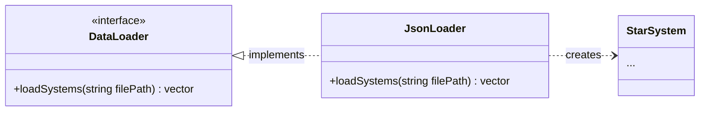
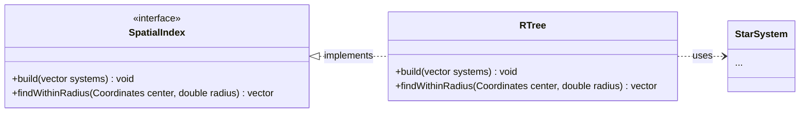
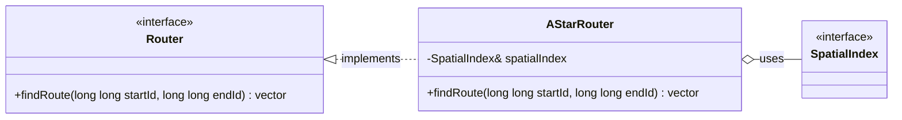
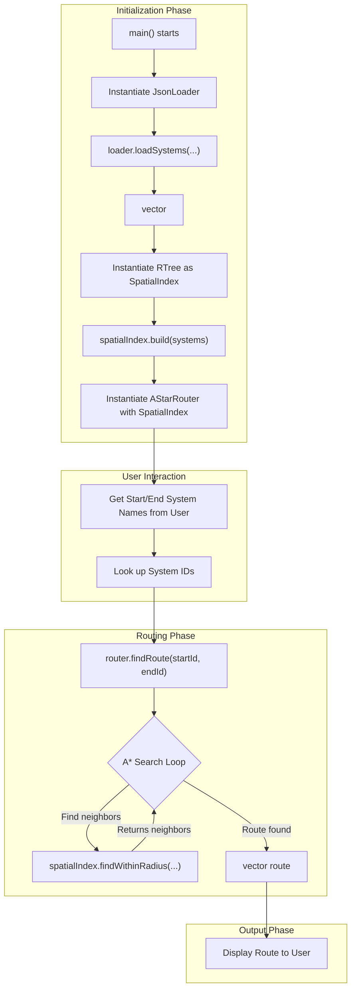

# C++ Engine Design

This document outlines the proposed file structure and high-level design for the C++ routing engine, which resides in the `engine/` directory.

## 1. File Structure and Responsibilities

The engine is broken into several modules (`core`, `io`, `spatial`, `routing`), each with a clear responsibility. The public-facing interfaces are defined in header files (`.hpp`) within `engine/include/elite_router/`, and their logic is implemented in source files (`.cpp`) within `engine/src/`.

### `engine/include/elite_router/` - Public Interfaces (Headers)
*   **`core/Coordinates.hpp`**: A simple struct to represent X, Y, Z coordinates.
*   **`core/StarSystem.hpp`**: A class/struct defining a star system, holding properties like `id64`, `name`, `coords`, etc.
*   **`io/DataLoader.hpp`**: Defines the interface for loading system data, e.g., `loadSystems(...)`.
*   **`spatial/SpatialIndex.hpp`**: Defines the interface for the spatial index (R-tree), with methods like `build(...)` and `findWithinRadius(...)`.
*   **`routing/Router.hpp`**: Defines the main routing interface, with a key method like `findRoute(...)`.

### `engine/src/` - Private Implementations (Source)
*   **`core/StarSystem.cpp`**: Implementation for the `StarSystem` class methods.
*   **`io/JsonLoader.cpp`**: Implements the `DataLoader` to parse system data from `.json` files.
*   **`spatial/RTree.cpp`**: The core implementation of the R-tree data structure for the `SpatialIndex`.
*   **`routing/AStar.cpp`**: The implementation of the A* pathfinding algorithm.
*   **`app/main.cpp`**: A simple main entry point for a standalone executable to test the engine's functionality.

---

## 2. Class Diagrams

These diagrams show the high-level relationships between the main classes in each module.

### Core Module

### IO Module

### Spatial Module

### Routing Module

---

## 3. Process Flowchart

This flowchart shows the typical sequence of operations when the application runs to find a route.

