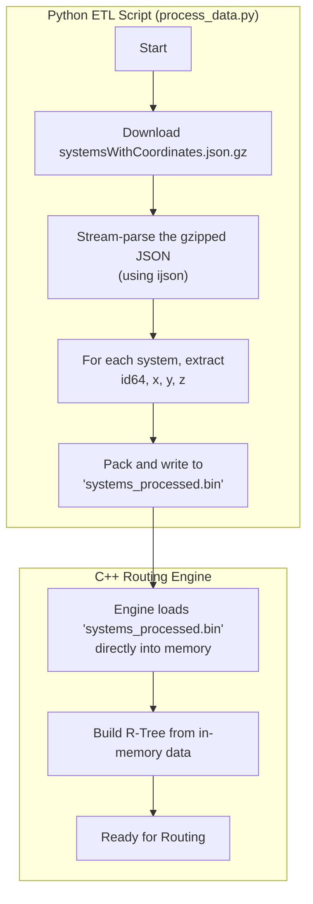

# Data Pipeline

This directory contains scripts and tools for the project's data engineering tasks, forming an ETL (Extract, Transform, Load) pipeline.

## ETL Module (`etl/`)

The `etl/` subdirectory contains the primary Python-based pipeline for processing bulk data dumps (e.g., from EDSM) into a format optimized for the C++ routing engine.

Refer to the `etl/SETUP.md` guide for instructions on how to set up the Python environment and run the scripts.

## V1 Pipeline Flowchart

This flowchart visualizes the V1 data pipeline, which processes the raw data dump into a custom binary file for direct consumption by the C++ engine, bypassing the need for a database.



---

## Testing Strategy

To ensure the reliability and correctness of the ETL pipeline, we will implement a multi-layered testing regime.

### 1. Unit Testing

*   **Purpose:** To test individual functions and logic components in isolation.
*   **Tool:** `pytest`
*   **Strategy:**
    *   **Data Processing Logic:** Use small, hand-crafted `sample_input.json` and corresponding `expected_output.bin` files. Tests will run the `process_data()` function against this sample and assert byte-for-byte equality of the output.
    *   **Network Operations:** Use `pytest-mock` to mock network requests (e.g., `requests.get`) to test download logic without actual internet access.

### 2. Integration Testing

*   **Purpose:** To verify that different parts of the script (decompression, parsing, extraction, packing) work correctly together.
*   **Tool:** `pytest`
*   **Strategy:** Run the entire pipeline on a small, yet realistic, gzipped sample of the EDSM data to ensure end-to-end functionality.

### 3. Static Analysis

*   **Purpose:** To maintain code quality, consistency, and identify potential issues early.
*   **Tools:**
    *   **Linter:** `flake8`
    *   **Formatter:** `black`

### Proposed Test Directory Structure

Tests will be co-located with the `etl` module:

```
pipeline/etl/
|-- process_data.py
|-- requirements.txt
|-- SETUP.md
`-- tests/
    |-- sample_data/
    |   |-- sample_input.json
    |   `-- expected_output.bin
    `-- test_processing.py
```
