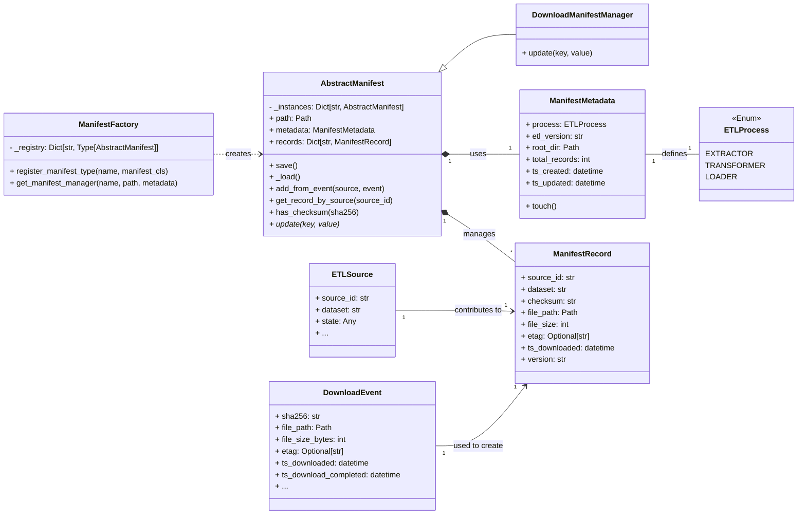

# ETL Manifest Strategy

This document outlines the design and implementation of a robust manifest system for the ETL pipeline, leveraging Pydantic for schema validation and a centralized `ManifestManager` to track the state of extracted and processed data.

## 1. The Problem: Tracking ETL State

In an ETL pipeline, a "manifest" serves as a crucial ledger for tracking the status and metadata of every file or record processed. It acts as a single source of truth for:

*   **Deduplication:** Preventing reprocessing of identical data.
*   **State Management:** Knowing which files have been downloaded, validated, or loaded.
*   **Traceability:** Auditing the lineage and integrity of data.
*   **Efficiency:** Skipping unnecessary processing steps based on historical data.

## 2. The Strategy: Pydantic-driven Manifests

To meet these requirements, we combine an Abstract Base Class (ABC) for the core `ManifestManager` logic with Pydantic for schema validation and a Factory for instantiation. This approach prioritizes **composition over inheritance** and ensures data consistency across the pipeline.

### 2.1. Core Pydantic Models for Manifest State

The manifest's structure is defined by these immutable Pydantic models, ensuring data integrity and clear communication between components.

#### `ETLProcess` Enum (`common/constants.py`)

A clear enumeration of ETL processes prevents arbitrary string usage and improves code clarity.

```python
# common/constants.py
from enum import Enum

class ETLProcess(Enum):
    EXTRACTOR = "extractor"
    TRANSFORMER = "transformer"
    LOADER = "loader"
```

#### `ManifestMetadata` Model

This model tracks the "global" state and properties of the manifest file itself.

```python
from pydantic import BaseModel, Field, ConfigDict
from datetime import datetime, timezone
from pathlib import Path
from typing import Optional
from ..constants import ETLProcess # Assuming common.config is at the same level as common.manifests

class ManifestMetadata(BaseModel):
    model_config = ConfigDict(populate_by_name=True)

    process: ETLProcess        # e.g., ETLProcess.EXTRACTOR
    etl_version: str           # e.g., "1.0.0"
    root_dir: Path             # The directory where the manifest lives
    
    # Automatic Stats
    total_records: int = 0
    ts_created: datetime = Field(default_factory=lambda: datetime.now(timezone.utc))
    ts_updated: datetime = Field(default_factory=lambda: datetime.now(timezone.utc))

    def touch(self):
        """Update the last-modified timestamp."""
        self.ts_updated = datetime.now(timezone.utc)
```

#### `ManifestRecord` Model

This represents an individual successful event or file. `frozen=True` ensures immutability once a record is created, safeguarding its integrity.

```python
from pydantic import BaseModel, Field, ConfigDict
from datetime import datetime
from pathlib import Path
from typing import Optional

class ManifestRecord(BaseModel):
    model_config = ConfigDict(frozen=True) # Ensure records are immutable once saved

    source_id: str             # e.g., "spansh_systems"
    dataset: str               # e.g., "star_systems"
    checksum: str = Field(..., pattern=r"^[a-fA-F0-9]{64}$") # Validates SHA256 format
    
    # Location and Size
    file_path: Path
    file_size: int = Field(gt=0)
    
    # Remote Metadata
    etag: Optional[str] = None
    
    # Tracking
    ts_downloaded: datetime
    version: str               # Version of the ETL code that produced this file
```

### 2.2. The `ManifestManager` Class

The `ManifestManager` acts as the central interface for interacting with the manifest. It uses a **Singleton/Registry pattern** to ensure only one instance of a specific manifest type exists and handles atomic saving.

```python
import json
import os
import shutil
import logging
from pathlib import Path
from typing import Dict, Any, Optional, Type
from abc import ABC, abstractmethod

# Assuming these are defined elsewhere or will be passed in
# from common.config.settings import etl_settings 
# from extractor.download.models import DownloadEvent
# from etl.src.extractor.sources.model import ETLSource

# Placeholder imports for now, actual implementation needs these
class ETLSource:
    source_id: str
    dataset: str
    state: Any # e.g. StateModel
    # ... other fields
    
class DownloadEvent:
    sha256: str
    file_path: Path
    file_size_bytes: int
    etag: Optional[str] = None # Added for consistency with ManifestRecord
    ts_download_completed: datetime
    # ... other fields

logger = logging.getLogger(__name__)

class AbstractManifest(ABC):
    """Abstract base class for manifest operations."""
    
    _instances: Dict[str, 'AbstractManifest'] = {}
    
    def __new__(cls, path: Path, metadata: 'ManifestMetadata'):
        # Enforce Singleton/Registry pattern per path
        if str(path) not in cls._instances:
            instance = super().__new__(cls)
            cls._instances[str(path)] = instance
            instance._initialized = False # Use a flag to ensure __init__ runs once
        return cls._instances[str(path)]

    def __init__(self, path: Path, metadata: 'ManifestMetadata'):
        if self._initialized:
            return
        
        self.path = path
        self.metadata = metadata
        self.records: Dict[str, ManifestRecord] = {} # Keyed by checksum
        self._load()
        self._initialized = True

    def _load(self):
        """Loads manifest data from disk, or initializes a skeleton."""
        if self.path.exists() and self.path.is_file():
            try:
                with open(self.path, 'r') as f:
                    content = json.load(f)
                    self.metadata = ManifestMetadata(**content.get("metadata", {}))
                    self.records = {
                        sha: ManifestRecord(**rec)
                        for sha, rec in content.get("records", {}).items()
                    }
                    self.metadata.total_records = len(self.records)
                    logger.info(f"Manifest loaded from {self.path} with {len(self.records)} records.")
                    return
            except json.JSONDecodeError as e:
                logger.error(f"Corrupted manifest file {self.path}: {e}. Initializing new manifest.")
            except Exception as e:
                logger.error(f"Error loading manifest {self.path}: {e}. Initializing new manifest.")

        # Initialize new manifest with provided metadata
        self.metadata.total_records = 0
        logger.info(f"Initialized new manifest at {self.path}.")

    def save(self):
        """Atomic save to prevent manifest corruption on Linux."""
        self.metadata.touch()
        self.metadata.total_records = len(self.records)
        output = {
            "metadata": self.metadata.model_dump(mode="json"),
            "records": {sha: rec.model_dump(mode="json") for sha, rec in self.records.items()}
        }
        
        # The Linux 'Atomic' Swap: Write to temp, then replace
        temp_path = self.path.with_suffix(".tmp")
        try:
            # Ensure directory exists on Linux
            self.path.parent.mkdir(parents=True, exist_ok=True)
            with open(temp_path, "w") as f:
                json.dump(output, f, indent=4)
            shutil.move(str(temp_path), str(self.path)) # Atomic replacement
            logger.debug(f"Manifest saved atomically to {self.path}")
        except Exception as e:
            if temp_path.exists():
                temp_path.unlink() # Clean up temp file on failure
            raise OSError(f"Failed to write manifest to disk: {e}")

    def add_from_event(self, source: ETLSource, event: DownloadEvent):
        """
        Directly converts a successful DownloadEvent into a Manifest entry.
        """
        # Ensure event has etag, or fetch from source.state if available
        event_etag = event.etag if event.etag is not None else getattr(source.state, 'last_etag', None)
        
        record_params = {
            "source_id": source.source_id,
            "dataset": source.dataset,
            "checksum": event.sha256,
            "file_path": event.file_path, # Path object serializes via Pydantic model_dump
            "file_size": event.file_size_bytes,
            "etag": event_etag,  # Metadata from the Prober/Event
            "ts_downloaded": event.ts_download_completed,
            "version": self.metadata.etl_version # Use manifest's ETL version
        }
        record = ManifestRecord(**record_params)
        self.records[record.checksum] = record
        self.save() # Save after each addition for robustness

    def get_record_by_source(self, source_id: str) -> Optional[ManifestRecord]:
        """
        Finds the most recent record for a specific source.
        Useful for the Orchestrator's state-check step.
        """
        matching = [r for r in self.records.values() if r.source_id == source_id]
        if not matching:
            return None
        # Sort by timestamp to ensure we get the latest if duplicates exist
        return sorted(matching, key=lambda x: x.ts_downloaded, reverse=True)[0]

    def has_checksum(self, sha256: str) -> bool:
        """Quick check if a file with this checksum has ever been processed."""
        return sha256 in self.records

    @abstractmethod
    def update(self, key: str, value: Dict[str, Any]):
        """Abstract method for specific manifest types to implement custom update logic."""
        pass

class DownloadManifestManager(AbstractManifest):
    """Specific manager for tracking download events."""
    def update(self, key: str, value: Dict[str, Any]):
        # Example of specific validation for a download manifest
        required_fields = ["checksum", "etag", "file_path", "file_size"]
        if not all(k in value for k in required_fields):
            raise ValueError(f"Missing required fields for DownloadManifestManager: {required_fields}")
        # In a Pydantic setup, you'd use ManifestRecord(**value) here
        logger.warning("Direct update() on DownloadManifestManager is deprecated. Use add_from_event().")

# Manifest Factory
class ManifestFactory:
    _registry: Dict[str, Type[AbstractManifest]] = {}

    @classmethod
    def register_manifest_type(cls, name: str, manifest_cls: Type[AbstractManifest]):
        cls._registry[name] = manifest_cls

    @classmethod
    def get_manifest_manager(
        cls, 
        manifest_type_name: str, 
        path: Path, 
        metadata: ManifestMetadata
    ) -> AbstractManifest:
        manifest_cls = cls._registry.get(manifest_type_name)
        if not manifest_cls:
            raise ValueError(f"Unknown manifest type: {manifest_type_name}. Please register it.")
        
        return manifest_cls(path=path, metadata=metadata)

# Register default manifest types
ManifestFactory.register_manifest_type("downloads", DownloadManifestManager)
# ManifestFactory.register_manifest_type("processed", ProcessedManifestManager) # Example for future
```

### 2.3. Interaction with the `PipelineOrchestrator`

The `PipelineOrchestrator` will use the `ManifestManager` as a "State Database" to make informed decisions throughout the ETL process.

| Step | Orchestrator Action | `ManifestManager` Method |
| :--- | :--- | :--- |
| **State Check** | "Do I have this ETag already for this source?" | `get_record_by_source(source_id)` |
| **Deduplication** | "Have I ever seen this file content (checksum)?" | `has_checksum(sha256)` |
| **Completion** | "Register the successful download." | `add_from_event(source, event)` |

## 3. Design Rationale & Benefits

This approach provides a robust and maintainable manifest system for your Linux-based ETL pipeline:

*   **Content Addressing (SHA256 Key):** By keying records by SHA256, you automatically handle situations where identical data might come from different sources or URLs. If two different Spansh URLs provide the exact same data file, your manifest only stores the record once, preventing redundant processing.
*   **Immutability:** Setting `frozen=True` on `ManifestRecord` prevents any logic later in the pipeline from accidentally changing critical metadata like the checksum or file path of a processed record.
*   **Validation:** The `checksum` pattern in `ManifestRecord` ensures that if the JSON manifest is ever manually corrupted (e.g., a broken SHA256 string), Pydantic will fail to load the manifest, immediately alerting you to the problem.
*   **Audit Trail:** Fields like `ts_downloaded` and `version` allow you to track exactly when a file was processed and by which version of your ETL code. This is crucial for debugging and understanding data lineage, especially if data transformation logic changes over time.
*   **Atomic Saves:** Using a temporary file and `shutil.move()` ensures that the manifest file on disk is never in a corrupted intermediate state, even if the system crashes during a write operation. This is a critical pattern for data integrity on Linux filesystems.
*   **Pydantic Serialization:** Pydantic's `model_dump(mode="json")` handles the automatic serialization of specialized types (like `Path` objects into strings and `datetime` objects into ISO-8601 strings), preventing common JSON serialization errors.

## 4. Visualizing the Manifest Structure & Interactions



## 5. Manifest Creation and Naming Conventions

### 5.1. The Recommended Skeleton

A fresh `manifest.json` should be as minimal as possible while providing enough metadata. Instead of an empty file (which causes `JSONDecodeError`), a "fresh" manifest should contain a skeleton structure that separates pipeline metadata from the actual data records, using our Pydantic models for structure.

```json
{
    "metadata": {
        "process": "extractor",
        "etl_version": "1.0.0",
        "root_dir": "/path/to/etl/manifests",
        "total_records": 0,
        "ts_created": "2023-01-01T12:00:00Z",
        "ts_updated": "2023-01-01T12:00:00Z"
    },
    "records": {}
}
```
This structure ensures that even if the manifest is "empty" of records, you know which version of the ETL created it and for what purpose.

### 5.2. Naming Conventions

Manifest files should be named based on the Process and the Domain, rather than the specific instance, using a clear pattern.

**Pattern:** `<domain>_<process>.manifest.json`

**Examples:**
*   `systems_download.manifest.json`
*   `bodies_ingestion.manifest.json`
*   `prices_validation.manifest.json`

Using `.manifest.json` as a double extension makes it immediately clear during a Linux `ls` command which files are data and which are metadata.

### 5.3. Organization: Centralized vs. Distributed

For an ETL pipeline, keeping manifests in a single dedicated directory is generally superior to placing them near the data files.

| Strategy          | Pros                                                                    | Cons                                                                                                        |
| :---------------- | :---------------------------------------------------------------------- | :---------------------------------------------------------------------------------------------------------- |
| **Centralized**   | Easy to back up; prevents cluttering data lake; easy to clear/reset state. | If you move data files, the manifest doesn't move with them automatically.                                  |
| **Distributed**   | Portable; moving a folder moves its metadata.                           | Harder to "scan" the status of the whole pipeline; risks accidental deletion during data cleanup.             |

**The Verdict:** Use a Centralized Directory (`etl/manifests/`)

#### Recommended Directory Structure
```
srv/elite-dangerous-dev/pipeline/
├── data/
│   ├── raw/            # immutable source files
│   └── processed/      # transformed files
├── etl/
│   ├── manifests/      # <--- ALL manifest JSONs live here
│   │   ├── systems_download.manifest.json
│   │   └── systems_processing.manifest.json
│   └── src/
└── config/             # etl.config.json (contains the path to etl/manifests/)
```

This works well for a Linux environment due to:
*   **Permissions:** You only need to grant write permissions to one specific directory (`etl/manifests/`) for the ETL user.
*   **Git Ignore:** You can easily ignore all manifests in development by adding `etl/manifests/*.json` to your `.gitignore`, while keeping your source data folders visible.
*   **Atomic Operations:** Since all manifests are in one place, you can verify the entire "health" of your pipeline by scanning one directory.
