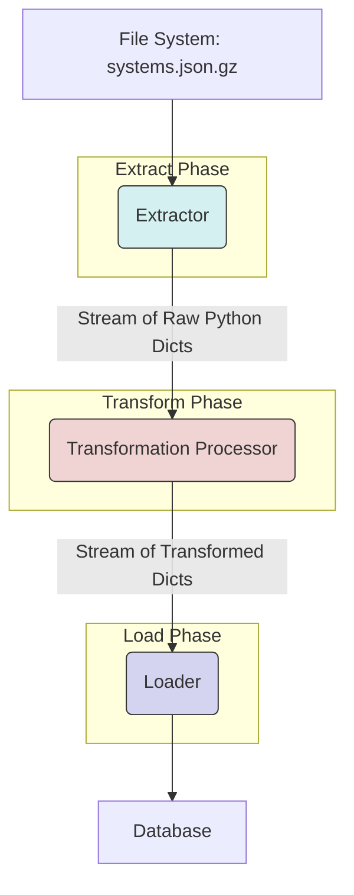
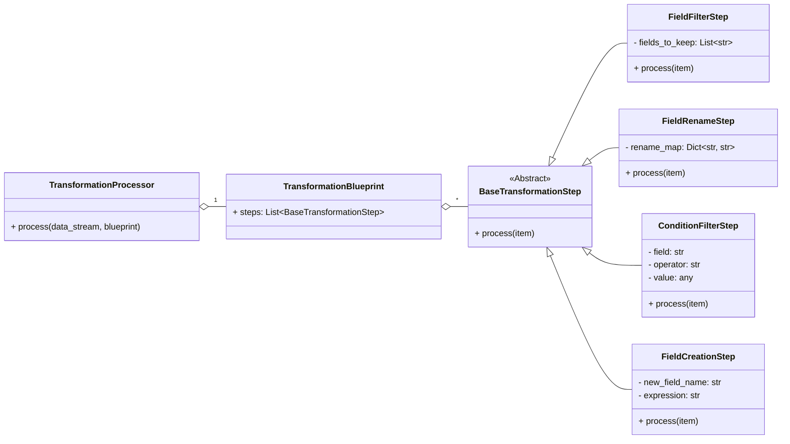

# ETL Strategy: Extract & Transform

This document outlines the design and architecture for the "Extract" and "Transform" stages of the ETL pipeline. The primary goals of this design are **scalability**, **memory efficiency**, and a **clear separation of concerns** to allow for the easy addition of new data transformations.

The process begins after a `.json.gz` file has been successfully downloaded and validated by the initial extraction phase, and is ready for processing from the `etl/data/downloads/` directory.

## 1. Delineation: Extract vs. Transform

A clear boundary between Extract and Transform is crucial for a modular pipeline.

-   **Extract**: This phase is responsible for reading data from its source format and converting it into a structured, in-memory representation. **The process ends once the data is fully parsed into a language-native object (e.g., a Python dictionary or Pydantic model), free from its source formatting.**
    -   **Input:** A file path (e.g., `/path/to/systems.json.gz`).
    -   **Actions:** Decompressing the Gzip stream, parsing the JSON stream.
    -   **Output:** A stream of Python dictionaries, one for each top-level object in the JSON file.

-   **Transform**: This phase begins immediately after Extraction. It takes the stream of Python objects and modifies them to fit the requirements of a specific "destination" or purpose (e.g., a database table, a routing algorithm's input).
    -   **Input:** A stream of Python dictionaries.
    -   **Actions:** Filtering out unneeded objects, selecting specific fields, renaming fields, creating new calculated fields.
    -   **Output:** A stream of *transformed* Python dictionaries.

## 2. High-Level Architecture: A Streaming Pipeline

To handle potentially massive data files without consuming excessive memory, the entire Extract/Transform process is designed as a **streaming pipeline**. Data is processed one record at a time, flowing through a series of components.



## 3. The Extractor: Efficiently Reading Large JSON

The `Extractor`'s sole responsibility is to efficiently read the source file. To avoid loading a potentially multi-gigabyte JSON file into memory, it uses a streaming JSON parser.

-   **Technology:** The `ijson` library is recommended for this. It can parse a JSON stream and yield objects as it finds them, keeping memory usage minimal.
-   **Implementation:** An `Extractor` class will take a file path, open the gzipped file, and wrap it in an `ijson.items()` call. This will create a **generator**, which yields one Python dictionary for each element in the top-level JSON array.

## 4. The Transformation Processor: A Scalable "Blueprint" Pattern

This is the core of the scalable design. Instead of writing a new Python function for every transformation, we define transformations as a sequence of simple, reusable steps. This sequence is a "Transformation Blueprint."

The **Pipeline Pattern** is used here. A `TransformationProcessor` takes a "blueprint" and a stream of data. For each item in the stream, it passes the item through the sequence of steps defined in the blueprint.

### 4.1. The Component Class Diagram



### 4.2. Transformation Steps

Each step is a simple class that performs one, and only one, job.

-   **`FieldFilterStep`**: Selects a subset of keys from a dictionary.
    -   *Example:* Keep only `id64`, `name`, `x`, `y`, and `z` for the routing data.
-   **`FieldRenameStep`**: Renames keys in a dictionary.
    -   *Example:* Rename `id64` to `system_id`.
-   **`ConditionFilterStep`**: Acts as a "gate." It only passes the item through if a condition is met. If not, it returns `None`, and the item is dropped from the pipeline.
    -   *Example:* Only keep systems where `population > 0`.
-   **`FieldCreationStep`**: Adds a new key/value pair to the dictionary, often by combining other fields.
    -   *Example:* Create a `name_upper` field from `item['name'].upper()`.

### 4.3. The "Blueprint"

A blueprint is a simple data structure (e.g., a Pydantic model or a JSON object) that defines the pipeline for the `TransformationProcessor`. This allows you to define complex transformations without writing new code.

**Example Blueprint for Routing Data:**
```json
{
  "name": "CreateRoutingData",
  "description": "Extracts ID and coordinates for the routing subroutine.",
  "steps": [
    {
      "step_type": "FieldFilter",
      "config": {
        "fields_to_keep": ["id64", "name", "x", "y", "z", "population"]
      }
    },
    {
      "step_type": "ConditionFilter",
      "config": {
        "field": "population",
        "operator": "gt",
        "value": 0
      }
    },
    {
      "step_type": "FieldRename",
      "config": {
        "rename_map": {
          "id64": "system_id"
        }
      }
    }
  ]
}
```

By using this pattern, creating a new transformation for a different purpose (e.g., "find all earth-like worlds") is as simple as creating a new blueprint JSON file. This design is highly scalable and maintainable.
