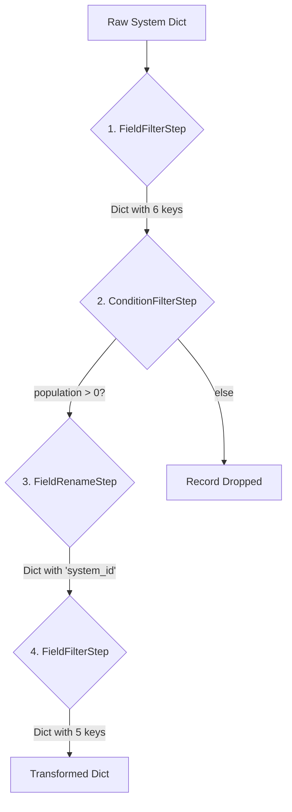

# Transformation Blueprints & Examples

This document provides concrete examples of "Transformation Blueprints" as defined in the `extract_transform_strategy.md` document. A blueprint is a declarative recipe that defines a series of steps to transform raw data for a specific purpose.

## Use Case 1: Preparing Data for a Routing Subroutine

A common requirement for an Elite Dangerous tool is a fast and efficient routing algorithm. Such an algorithm doesn't need to know about a star's spectral class or the factions present; it primarily needs system IDs, names, and their 3D coordinates.

This blueprint transforms the raw, verbose system data into a lean format perfect for a routing engine.

### 1. Sample Input Data

The `Extractor` reads the source `.json.gz` file and yields a stream of Python dictionaries. A single dictionary from the stream might look like this (abbreviated for clarity):

```json
{
  "id": 2394231,
  "id64": 10477373803,
  "name": "Sol",
  "x": 0.0,
  "y": 0.0,
  "z": 0.0,
  "population": 2147483647,
  "is_populated": true,
  "government": "Democracy",
  "allegiance": "Federation",
  "primary_star": {
    "type": "G (White-Yellow) Star",
    "is_scoopable": true
  },
  "body_count": 80,
  "bodies": [
    { "name": "Mercury", "type": "Planet", "distance_to_arrival": 313 },
    { "name": "Earth", "type": "Planet", "distance_to_arrival": 1032 }
  ]
}
```

### 2. Transformation Goal

The goal is to produce a dictionary containing only `system_id` (renamed from `id64`), `name`, and the `x`, `y`, `z` coordinates. We also want to filter out any uninhabited systems, as they might not be relevant for a standard A-to-B route.

### 3. The Blueprint Definition

This JSON object defines the steps for the `TransformationProcessor`.

```json
{
  "name": "CreateRoutingData",
  "description": "Extracts ID and coordinates for the routing subroutine, filtering for populated systems.",
  "steps": [
    {
      "step_type": "FieldFilter",
      "description": "Keep only the necessary fields for routing and population check.",
      "config": {
        "fields_to_keep": ["id64", "name", "x", "y", "z", "population"]
      }
    },
    {
      "step_type": "ConditionFilter",
      "description": "Only process systems with a population greater than zero.",
      "config": {
        "field": "population",
        "operator": "gt",
        "value": 0
      }
    },
    {
      "step_type": "FieldRename",
      "description": "Rename 'id64' to 'system_id' for the destination schema.",
      "config": {
        "rename_map": {
          "id64": "system_id"
        }
      }
    },
    {
      "step_type": "FieldFilter",
      "description": "Final cleanup: remove the 'population' field which is no longer needed.",
      "config": {
        "fields_to_keep": ["system_id", "name", "x", "y", "z"]
      }
    }
  ]
}
```

### 4. Transformation Pipeline Flow

This flowchart visualizes the journey of a single record through the blueprint's steps.



### 5. Final Output Data

After the `TransformationProcessor` applies all the steps in the blueprint to the sample input, the resulting dictionary is:

```json
{
  "system_id": 10477373803,
  "name": "Sol",
  "x": 0.0,
  "y": 0.0,
  "z": 0.0
}
```

This lean, predictable object is now ready to be loaded into a database table or consumed directly by the routing subroutine. By defining other blueprints, you can produce completely different outputs (e.g., for finding scoopable stars, for locating Earth-like worlds) from the exact same source data stream without writing redundant extraction code.
