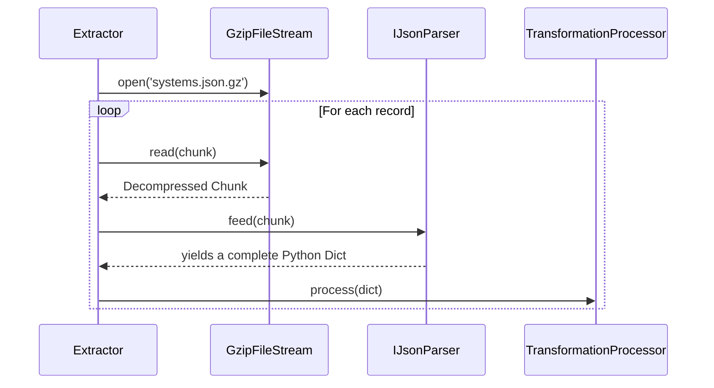
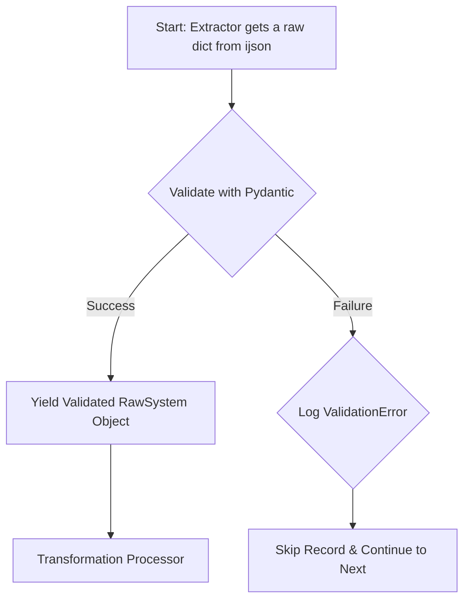

# Data Strategy: Validation, Schemas, and Safe Parsing

This document provides a deep dive into the strategy for handling raw data files from community sources. Given that this data may lack a formal, enforced schema and can be enormous, a robust, multi-layered defensive strategy is required to ensure the pipeline is reliable, efficient, and maintainable.

## 1. The Core Challenge: Untrusted, Large-Scale Data

When processing community-sourced data dumps, we must assume:
-   **The format might be wrong:** A file ending in `.gz` might be an HTML error page.
-   **The file might be corrupt:** The download could have been truncated.
-   **The schema is inconsistent:** Some records may be missing fields, or fields might have unexpected data types (e.g., `population` as a string instead of an integer).
-   **The files are too large:** A multi-gigabyte JSON file cannot be loaded into memory all at once.

Our design addresses each of these challenges systematically.

## 2. Layer 1: Knowing Your Data (Content-Type Detection)

Before any parsing begins, we must verify what kind of file we actually have. This is the responsibility of the **`SourceProber`**.

**Common Practice:** The prober uses "MIME sniffing" by analyzing the file's "magic bytes."

1.  **Request Headers (Clue):** The prober first checks the `Content-Type` HTTP header. This is a good first hint but is not trustworthy.
2.  **Content Analysis (Proof):** It then downloads the first few kilobytes of the file and uses the `python-magic` library to analyze the file's actual signature. This is the reliable way to confirm if a file is truly `application/gzip` or something else entirely.

By performing this step first, we prevent the pipeline from ever attempting to decompress a file that isn't actually compressed.

## 3. Layer 2: Efficient & Safe Parsing (Streaming)

To handle massive files, we **must stream the data**. We never load the entire decompressed file into memory. This is achieved by chaining together Python's built-in `gzip` library with the streaming JSON parser `ijson`.

### The Streaming Process



### Conceptual Implementation

The `Extractor` class orchestrates this streaming process, acting as a Python generator.

```python
import gzip
import ijson
from typing import Iterator, Dict, Any

class Extractor:
    def __init__(self, file_path: str):
        self.file_path = file_path

    def __iter__(self) -> Iterator[Dict[Any, Any]]:
        """
        Opens the .json.gz file and yields one object at a time.
        """
        with gzip.open(self.file_path, 'rb') as f:
            # The 'item' prefix assumes the JSON is a list of objects.
            # Adjust if the structure is different.
            yield from ijson.items(f, 'item')

# Usage:
# extractor = Extractor('etl/data/downloads/systems.json.gz')
# for raw_system_dict in extractor:
#     # This loop runs for every system, but only one is in memory at a time.
#     process_system(raw_system_dict)
```

**Conclusion:** You should **never** store a fully decompressed version of the source JSON file. It defeats the purpose of a streaming pipeline and needlessly consumes storage.

## 4. Layer 3: Enforcing a "Contract" (Pydantic Schema Validation)

This is the most critical layer for ensuring data quality. Just because an object is valid JSON doesn't mean it's valid for our application. We create a "contract"—our expected schema—using a Pydantic model.

### Deeper Dive: Defining the Schema

A Pydantic model for a raw system object should be both specific about required fields and forgiving about extra, unused data.

**Example Pydantic Model (`etl/src/extractor/models/raw_data.py`):**

```python
from pydantic import BaseModel, Field, ValidationError
from typing import List, Optional, Dict

class RawSystem(BaseModel):
    # Required fields: the pipeline will fail on a record if these are missing.
    id64: int
    name: str

    # Optional fields with default values.
    population: Optional[int] = 0
    is_populated: bool = False

    # Use an alias if the JSON field name is not a valid Python identifier
    # or if you want to use a different internal name.
    x_coord: float = Field(..., alias='x')
    y_coord: float = Field(..., alias='y')
    z_coord: float = Field(..., alias='z')

    # This tells Pydantic to ignore any fields in the JSON data
    # that are not defined in this model. This prevents errors
    # when the source data adds new, irrelevant fields.
    class Config:
        extra = 'ignore'
```

### Integrating Validation into the Extractor

The `Extractor` is modified to not just yield dictionaries, but to yield *validated Pydantic objects*. This is where we handle errors gracefully.

```python
# Updated Extractor implementation
class Extractor:
    def __init__(self, file_path: str):
        self.file_path = file_path

    def __iter__(self) -> Iterator[RawSystem]:
        with gzip.open(self.file_path, 'rb') as f:
            for record_dict in ijson.items(f, 'item'):
                try:
                    # Validate the raw dictionary against our Pydantic model
                    yield RawSystem(**record_dict)
                except ValidationError as e:
                    # If a record fails validation, log the error and continue.
                    # This makes the pipeline resilient to bad data.
                    system_name = record_dict.get('name', 'N/A')
                    print(f"Validation failed for system '{system_name}': {e}. Skipping record.")
                    continue
```

This loop is the heart of the robust pipeline. It ensures that only clean, predictable data is ever passed to the **Transform** phase.

## 5. The Role of Sample Data

**It is essential to keep a sample of the actual JSON data.**

-   **Location:** Store a small file (e.g., 10-20 records) in `etl/tests/data/samples/systems_sample.json`.
-   **Purpose:**
    1.  **Development:** You need it to inspect the data's structure to build your Pydantic models in the first place.
    2.  **Unit Testing:** It serves as the input for testing your transformation blueprints, allowing you to develop and verify your logic without using the full data files.

## Summary: The Ingestion Flow

This flowchart summarizes the complete, robust process for ingesting a single record.



By adopting this multi-layered strategy, you create a pipeline that is efficient with memory, resilient to errors in the source data, and maintainable due to the clear contract provided by the Pydantic schema.
