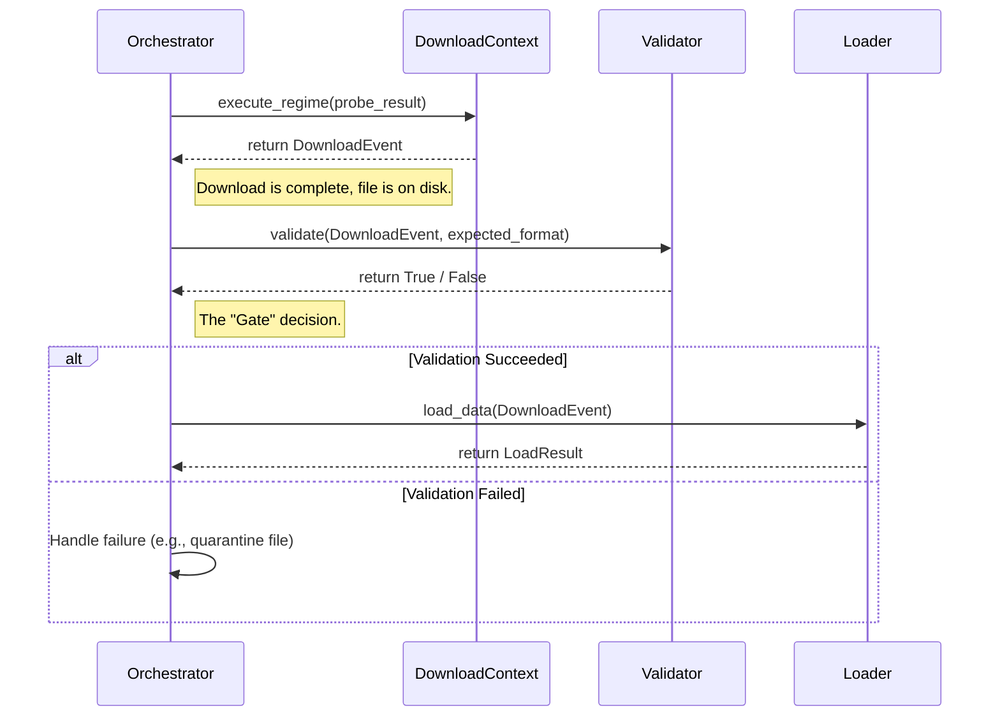

# Validator Class Design: The Quality Gatekeeper

In the ETL architecture, the `ValidatorClass` serves as the **Quality Gatekeeper**. It is responsible for inspecting the physical file on the Linux filesystem to ensure that what was downloaded actually matches the business requirements before it reaches the database via the `Loader`.

The Validator doesn't care about the network; it only cares about the downloaded artifact (the file) and the expectation (the source definition).

## 1. Core Responsibilities

The Validator performs a "Triple-Check" to ensure data quality after a file is written to disk:

1.  **Existence Check:** Verifies that the file specified in the `DownloadEvent` actually exists on the filesystem.
2.  **Format Verification (Magic Bytes):** Uses `python-magic` to read the file's signature (the "magic bytes") to confirm its MIME type. This prevents scenarios where an HTML error page is disguised as a `.gz` or `.json` file.
3.  **Integrity Verification (Checksum):** Re-calculates the SHA-256 hash of the file on disk and compares it to the hash recorded during the download. This ensures the file was not truncated or corrupted during the write process.

## 2. Implementation

The `ValidatorClass` is a service class that exposes a single primary method, `validate()`, to the orchestrator. It is initialized respecting the global `skip_validation` flag from the `ETLConfig`.

```python
import magic
import hashlib
import logging
from pathlib import Path
from common.config.settings import etl_settings
from extractor.download.models import DownloadEvent

logger = logging.getLogger(__name__)

class ValidatorClass:
    def __init__(self):
        # Respect the global skip_validation flag from our refactored config
        self.enabled = not etl_settings.orchestration.skip_validation

    def validate(self, event: DownloadEvent, expected_format: str) -> bool:
        """Entry point for the Orchestrator to verify the download."""
        if not self.enabled:
            logger.warning(f"Validation skipped via configuration for {event.file_path.name}")
            return True

        # 1. Existence Check
        if not event.file_path.exists():
            logger.error(f"File missing on disk: {event.file_path}")
            return False

        # 2. Format Verification (Magic Bytes)
        if not self._verify_mime_type(event.file_path, expected_format):
            return False

        # 3. Integrity Verification (Checksum)
        if not self._verify_checksum(event.file_path, event.sha256):
            return False

        logger.info(f"Successfully validated {event.file_path.name}")
        return True

    def _verify_mime_type(self, path: Path, expected: str) -> bool:
        """Uses python-magic to verify the file is actually what it claims to be."""
        actual_mime = magic.from_file(str(path), mime=True)
        # Handle common Elite Dangerous data formats
        valid_map = {
            "json": ["application/json", "text/plain"],
            "gzip": ["application/gzip", "application/x-gzip"],
            "csv": ["text/csv", "text/plain"]
        }
        
        valid_mimes = valid_map.get(expected.lower(), [expected])
        if actual_mime not in valid_mimes:
            logger.error(f"MIME Mismatch: Expected {expected} (valid: {valid_mimes}), got {actual_mime}")
            return False
        return True

    def _verify_checksum(self, path: Path, expected_sha256: str) -> bool:
        """Re-calculates the SHA-256 of the file on disk to ensure no corruption occurred."""
        sha256_hash = hashlib.sha256()
        try:
            with open(path, "rb") as f:
                # Read in 128KB chunks to stay memory-efficient on a ProDesk
                for byte_block in iter(lambda: f.read(128 * 1024), b""):
                    sha256_hash.update(byte_block)
            
            actual_sha256 = sha256_hash.hexdigest()
            if actual_sha256 != expected_sha256:
                logger.error(f"Checksum Mismatch! Expected: {expected_sha256}, Actual: {actual_sha256}")
                return False
            return True
        except Exception as e:
            logger.error(f"Error during checksum verification: {e}")
            return False
```

## 3. Interactions and Data Flow

The Validator is a middle-tier component that acts as a bridge between the **Extraction** and **Loading** phases.



Key class interactions:

*   **`PipelineOrchestrator`**: The brain of the operation. After the `DownloadContext` returns a `DownloadEvent`, the Orchestrator calls `validator.validate()`. It treats the boolean response as a gate for whether to proceed to the `Loader`.
*   **`DownloadEvent`**: This is the "Data Carrier." It provides the `file_path` and the `sha256` hash that the validator uses as the ground-truth for its checks.
*   **`ETLConfig`**: Provides the `orchestration.skip_validation` flag, allowing a global bypass for the entire validation step in emergencies or during development.

## 4. Design Rationale

This "Triple-Check" architecture is critical for handling unreliable community data sources (like Spansh or EDDN), which can occasionally fail mid-stream or serve an error page instead of the expected data.

1.  The **Prober** checks *before* the download.
2.  The **Download Regime** calculates the hash *while* downloading.
3.  The **Validator** confirms the file is safe *after* it's written to the Linux filesystem.

This layered approach ensures your database loader never tries to process a corrupted or incorrect file, preventing data corruption and runtime crashes.
