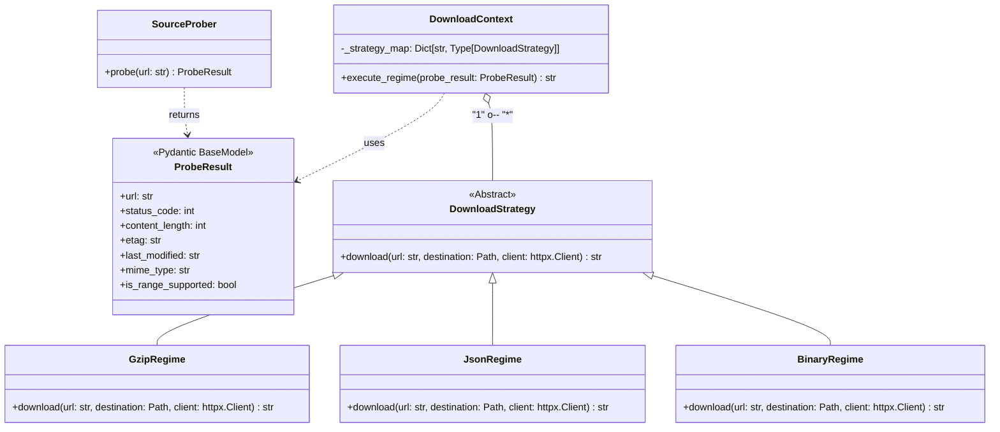

# Elite Dangerous ETL: Download Strategy & Probing

This document outlines the design of a sophisticated and efficient download mechanism for the ETL pipeline. The core components are the `SourceProber`, which inspects a remote file before committing to a full download, and the `DownloadContext`, which orchestrates the download process using a Strategy pattern.

This approach is designed to be bandwidth-efficient, safe, and robust, particularly for handling large data files from sources like Spansh.

---

## Architectural Diagrams

### Process Flow

This flowchart illustrates the end-to-end process, from probing the source to updating the manifest.

```mermaid
graph TD
    A[Start] --> B[Input: URL];
    B --> C[Call SourceProber.probe()];
    C --> D[HEAD request for headers];
    D --> E{Manifest record matches<br>ETag/Last-Modified?};
    E -- Yes --> F[Stop / Skip Download];
    E -- No --> G[GET request with<br>Range header for 1KB sample];
    G --> H[Determine MIME type with<br>python-magic];
    H --> I[Create ProbeResult object];
    I --> J[Call DownloadContext.execute_regime()];
    J --> K[Context selects strategy<br>from _strategy_map];
    K --> L{MIME type?};
    L -- application/gzip --> M[GzipRegime];
    L -- application/json --> N[JsonRegime];
    L -- Other --> O[BinaryRegime];
    M --> P[strategy.download()];
    N --> P;
    O --> P;
    P --> Q[Stream download,<br>calculating SHA-256 on the fly];
    Q --> R[Save file to destination];
    R --> S[Return SHA-256 hash];
    S --> T[Update Manifest with hash];
    T --> U[End];
```

### Class Relationships

This diagram shows the relationship between the key classes in the download system.



---

## Part 1: The `SourceProber`

The `SourceProber` acts as a "polite detective." Instead of immediately downloading a large file, it first gathers metadata from the server to make an informed decision. This "pre-flight check" saves bandwidth and prevents errors by verifying file details upfront.

### 1.1. Concept: The "Polite Detective"

Instead of grabbing the whole file, we ask the server questions first. Using `httpx` allows us to handle these modern web conversations efficiently.

### 1.2. Implementation

Here is a simplified `SourceProber` designed for the Linux ETL environment.

```python
import httpx
import magic
from pathlib import Path
from typing import Dict, Any, Optional
from pydantic import BaseModel, HttpUrl

class ProbeResult(BaseModel):
    """Container for the information gathered during probing."""
    url: str
    status_code: int
    content_length: Optional[int] = None
    etag: Optional[str] = None
    last_modified: Optional[str] = None
    mime_type: str = "unknown"
    is_range_supported: bool = False

class SourceProber:
    def __init__(self, timeout: int = 10):
        self.timeout = timeout

    def probe(self, url: str) -> ProbeResult:
        """
        Performs a 'Pre-flight' check on a remote source.
        1. HEAD request for headers.
        2. Partial GET (Range) for magic byte verification.
        """
        with httpx.Client(timeout=self.timeout, follow_redirects=True) as client:
            # --- Step 1: The HEAD Request ---
            # We get metadata without downloading the body.
            head_res = client.head(url)
            headers = head_res.headers

            # --- Step 2: Sample the Magic Bytes ---
            # We ask for only the first 1024 bytes (1KB).
            mime_type = "unknown"
            range_supported = headers.get("Accept-Ranges") == "bytes"
            
            try:
                # Attempt to grab the first 1KB
                sample_res = client.get(url, headers={"Range": "bytes=0-1023"})
                if sample_res.status_code in (200, 206):
                    # Use python-magic to 'sniff' the file type from the buffer
                    mime_type = magic.from_buffer(sample_res.content, mime=True)
            except Exception as e:
                print(f"Sampling failed: {e}")

            return ProbeResult(
                url=url,
                status_code=head_res.status_code,
                content_length=headers.get("Content-Length"),
                etag=headers.get("ETag"),
                last_modified=headers.get("Last-Modified"),
                mime_type=mime_type,
                is_range_supported=range_supported
            )
```

### 1.3. Component Breakdown

-   **`httpx.Client`**: Used because it handles HTTP/2 automatically, which is common for modern CDNs. The `with` statement ensures the connection is properly closed, which is good practice.

-   **The `HEAD` Request**: This is the key to version control. By fetching `Last-Modified` and `ETag` headers, we can compare them to our manifest records. If they match, the download can be skipped entirely.

-   **The `Range: bytes=0-1023` Header**: This is the sampling mechanism. It requests only the first 1KB of the file. If the server supports this (indicated by a `206 Partial Content` status), we can analyze the file type without downloading the entire file. If not, the server sends the whole file (status `200`).

-   **`python-magic`**: This library inspects the "magic numbers" (the first few bytes) of the received sample. For instance, a Gzip file always starts with `1f 8b`. This tells us the *actual* file type, even if the URL is misleading, allowing us to select the correct download and processing strategy.

### 1.4. How `SourceProber` Feeds the Download Regime

The output of the prober is used to determine which download strategy to employ.

```python
prober = SourceProber()
result = prober.probe("https://downloads.spansh.co.uk/systems.json.gz")

if "gzip" in result.mime_type:
    # Use the GzipDownloadStrategy
    regime = GzipRegime()
elif "json" in result.mime_type:
    # Use the JsonDownloadStrategy
    regime = JsonRegime()
```

---

## Part 2: The `DownloadContext` & Strategy Pattern

The `DownloadContext` acts as the orchestrator. It takes the `ProbeResult`, selects the appropriate download strategy (or "Regime"), and manages the download lifecycle. This keeps the main ETL logic clean and decoupled from the specifics of any single download method.

### 2.1. The Strategy Interface

First, we define an abstract base class for all download strategies. This ensures they all have a consistent interface for the `DownloadContext` to use.

```python
from abc import ABC, abstractmethod
from pathlib import Path
import hashlib
import httpx

class DownloadStrategy(ABC):
    @abstractmethod
    def download(self, url: str, destination: Path, client: httpx.Client) -> str:
        """Executes the download and returns the SHA-256 hex digest."""
        pass
```

### 2.2. The `DownloadContext` Implementation

The context's primary responsibility is to select a strategy and manage the HTTP session.

```python
from pathlib import Path
from typing import Dict, Type

class DownloadContext:
    def __init__(self, destination_dir: Path):
        self.destination_dir = destination_dir
        # Map MIME types to specific Strategy classes
        self._strategy_map: Dict[str, Type[DownloadStrategy]] = {
            "application/gzip": GzipRegime,
            "application/x-gzip": GzipRegime,
            "application/json": JsonRegime,
            "application/octet-stream": BinaryRegime # Fallback
        }

    def execute_regime(self, probe_result: ProbeResult) -> str:
        """
        1. Selects the strategy based on the probe's MIME type.
        2. Manages the HTTP session.
        3. Returns the resulting SHA-256 hash.
        """
        # --- 1. Strategy Selection ---
        strategy_class = self._strategy_map.get(
            probe_result.mime_type, 
            BinaryRegime # Default fallback
        )
        strategy = strategy_class()

        # --- 2. Execution ---
        filename = Path(probe_result.url).name
        dest_path = self.destination_dir / filename

        # Using a shared client for the actual download
        with httpx.Client(timeout=None) as client:
            print(f"Starting {strategy.__class__.__name__} for {filename}...")
            
            # The strategy handles the 'how', the Context handles the 'when'
            sha256_hash = strategy.download(probe_result.url, dest_path, client)
            
            return sha256_hash
```

### 2.3. A Concrete Strategy: `GzipRegime`

This is an example of a concrete strategy implementation. It handles the streaming download and on-the-fly SHA-256 hash calculation.

```python
class GzipRegime(DownloadStrategy):
    def download(self, url: str, destination: Path, client: httpx.Client) -> str:
        sha256 = hashlib.sha256()
        
        with client.stream("GET", url) as response:
            response.raise_for_status()
            
            with open(destination, "wb") as f:
                # Iterate over the response in 128KB chunks
                for chunk in response.iter_bytes(chunk_size=128 * 1024):
                    # Update hash WHILE the data is in memory
                    sha256.update(chunk)
                    # Write to the Linux filesystem
                    f.write(chunk)
                    
        return sha256.hexdigest()
```

*(Note: `JsonRegime` and `BinaryRegime` would be implemented similarly, tailored to their specific file types.)*

### 2.4. Design Benefits

-   **Registry over Logic**: Instead of a complex `if/elif` block, the `_strategy_map` dictionary provides a clean, extensible way to register new file types. Adding support for a new format (e.g., Zstandard) is as simple as adding a new entry and a corresponding strategy class.
-   **Encapsulation**: The `DownloadContext` is decoupled from the details of downloading. It doesn't need to know how to decompress Gzip data; it only needs to select the right tool.
-   **Resource Management**: Wrapping the `httpx.Client` ensures connections are managed correctly, preventing resource leaks like "too many open files" errors.

---

## Summary: The Integrated Workflow

1.  **Probe**: The `SourceProber` handshakes with the server, getting headers and the MIME type (e.g., `application/gzip`).
2.  **Select**: The `DownloadContext` receives the `ProbeResult`, looks up the MIME type in its `_strategy_map`, and instantiates the correct strategy (e.g., `GzipRegime`).
3.  **Execute**: The selected strategy (`GzipRegime`) is executed. It streams the file, calculates the SHA-256 hash on-the-fly, and saves the file to disk.
4.  **Verify**: The final SHA-256 hash is returned and can be used to update the ETL manifest, ensuring data integrity.
