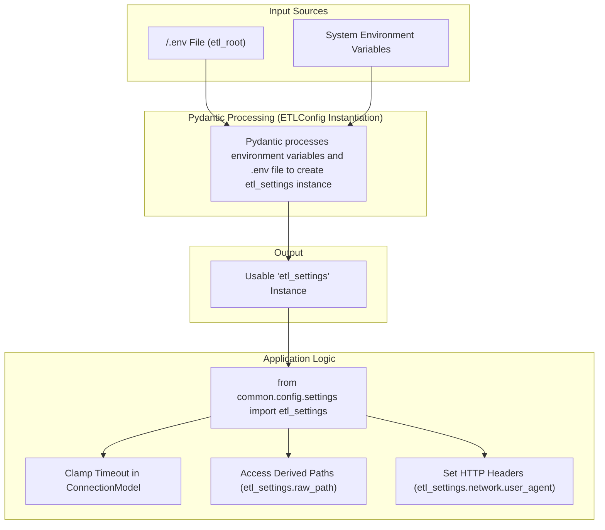
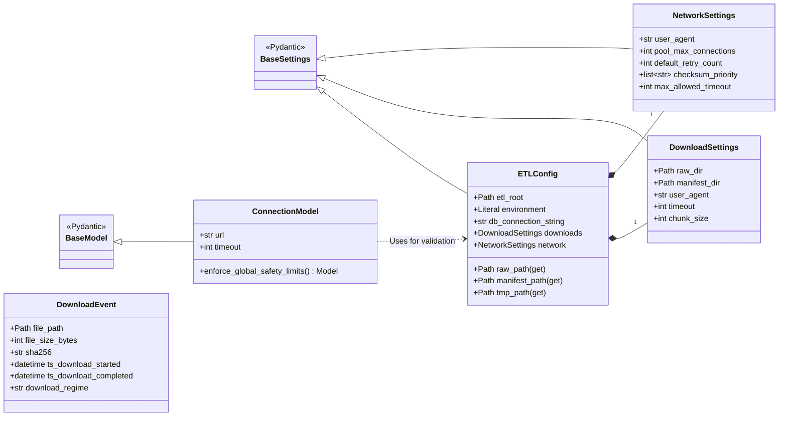

# ETL Component Configuration Strategy

Treating the ETL directory as a standalone component is a solid architectural decision, especially for a Linux-based pipeline where you want to isolate dependencies and testing. Using a specific `Configuration` class for that component is an industry-standard design pattern often referred to as **Component-Based Configuration** or **Bounded Contexts**.

This document outlines a layered approach to building a robust configuration management system for the ETL component.

### Configuration Data Flow
This chart illustrates the flow of data from environment variables and the `.env` file through Pydantic's processing pipeline to produce the final, validated `etl_settings` configuration object that the application uses.



## 1. Core Principles

### Bounded Context Configuration
The primary goal is to prevent "Configuration Pollution," where the ETL component might accidentally depend on variables meant for a different part of the project (like a future API or Frontend). By creating a self-contained configuration, we ensure the ETL component is portable and its dependencies are explicit.

### Improved Testability
A local `Config` class allows for running unit and integration tests without needing the entire `/srv/elite-dangerous-dev/` environment. We can simply provide a mock `.env` file or environment variables specific to the ETL logic (e.g., source database credentials or raw data paths) and test the component in complete isolation.

## 2. Basic Implementation with `BaseSettings`

The foundation of our configuration is Pydantic's `BaseSettings`. By placing the `Config` class in `.../etl/src/common/config/`, we can use `SettingsConfigDict` to look for an `.env` file specifically within the ETL sub-folder.

```python
# /srv/elite-dangerous-dev/pipeline/etl/src/common/config/settings.py
from pydantic_settings import BaseSettings, SettingsConfigDict
from pathlib import Path

class ETLConfig(BaseSettings):
    # This defaults to the etl subdirectory
    etl_root: Path = Path("/srv/elite-dangerous-dev/pipeline/etl")
    db_connection_string: str
    
    model_config = SettingsConfigDict(
        # Tells Pydantic to look for .env relative to this component
        env_file=".env",
        extra='ignore' 
    )

# Singleton instance for the ETL component
etl_settings = ETLConfig()
```

## 3. Enhanced Configuration: Nested & Computed Paths

Using `BaseSettings` with an `.env` file is the standard for modern Python services on Linux. Since the ETL process is data-heavy and path-dependent, we can expand this to include structural validation and nested configuration. This prevents the `ETLConfig` from becoming a flat, unmanageable list of strings.

### The Strategy: Nested & Computed Paths
Instead of hardcoding every path, we use Pydantic's `@computed_field` to derive paths from `etl_root`. This ensures that if the pipeline is moved to a different directory, only one variable needs to be updated.

### Enhanced Configuration Structure

```python
from pydantic import Field, computed_field
from pydantic_settings import BaseSettings, SettingsConfigDict
from pathlib import Path
from typing import Literal

class DownloadSettings(BaseSettings):
    """Specific settings for the extraction/download phase."""
    # Paths relative to etl_root
    raw_dir: Path = Path("data/raw")
    manifest_dir: Path = Path("data/manifests")
    
    # Network settings
    user_agent: str = "Elite-Dangerous-ETL/1.0"
    timeout: int = 30
    chunk_size: int = 128 * 1024  # 128KB

class ETLConfig(BaseSettings):
    # Core Environment
    etl_root: Path = Path("/srv/elite-dangerous-dev/pipeline/etl")
    environment: Literal["dev", "prod"] = "dev"
    db_connection_string: str
    
    # Nested Groups
    downloads: DownloadSettings = DownloadSettings()

    @computed_field
    @property
    def raw_path(self) -> Path:
        """Fully qualified path to raw data storage."""
        return self.etl_root / self.downloads.raw_dir

    @computed_field
    @property
    def manifest_path(self) -> Path:
        """Fully qualified path to the manifests."""
        return self.etl_root / self.downloads.manifest_dir

    model_config = SettingsConfigDict(
        env_file=".env",
        env_nested_delimiter="__", # Allows ETL_DOWNLOADS__TIMEOUT=60
        extra='ignore' 
    )

etl_settings = ETLConfig()
```

### Key Design Patterns Applied
*   **The "Base Directory" Pattern**: By anchoring everything to `etl_root`, the pipeline becomes portable.
*   **Nested Delimiters**: Setting `env_nested_delimiter="__"` allows you to override specific download settings in your `.env` or bash profile like this: `ETL_DOWNLOADS__TIMEOUT=60`.
*   **Directory Self-Healing**: You might consider adding a `model_validator` to ensure `raw_path` and `manifest_path` actually exist on the Linux filesystem, calling `os.makedirs` if they don't.

### Integration Tip: The User-Agent
Since you are downloading from Spansh and other community sources, they often appreciate (or require) a descriptive User-Agent. This can now be pulled directly into the application logic:
```python
# Inside SourceProber or DownloadContext
headers = {"User-Agent": etl_settings.downloads.user_agent}
```

## 4. Bridging Configuration with Application Logic

Based on properties in `ETLSource`, `ConnectionModel`, and `DownloadEvent`, the configuration is missing critical "bridge" settings. The existing classes define *how* to connect and *what* was found, but the `Config` needs to define the global limits and infrastructure that make those connections possible in a Linux environment.

Here are the specific gaps to address:

#### 1. Retry Infrastructure & Global Backoff
`ConnectionModel` has a `retry_policy`, but the `Config` should define the defaults for this policy.
*   **Missing**: `max_retries`, `backoff_factor`, `retryable_status_codes`.

#### 2. Temporal & Performance Tuning
A very long timeout (e.g., 7200 seconds) can exhaust process threads or file descriptors.
*   **Missing**: `pool_limits` (for concurrent connections), `connect_timeout` (for the initial handshake).

#### 3. Schema & Format Mapping
The configuration should act as the central registry that maps expected data formats to internal processing regimes.
*   **Missing**: `mime_map` (e.g., mapping `"json"` to `"application/json"`), `validation_strictness` (e.g., `strict_mime_check: bool`).

#### 4. Checksum Strategy Selection
A global source of truth is needed to prioritize checksum headers.
*   **Missing**: `checksum_preference` (e.g., `["s3_sha256", "content_md5", "etag"]`).

#### 5. Linux-Specific Execution Context
The configuration needs to handle permissions and temporary storage.
*   **Missing**: `temp_dir` (for partial downloads), `file_permissions` (e.g., `0o644`).

### Suggested Additions to ETLConfig
Here is how these missing pieces look integrated into the Pydantic settings:
```python
class NetworkSettings(BaseSettings):
    user_agent: str = "Elite-Dangerous-ETL/1.0"
    pool_max_connections: int = 10
    default_retry_count: int = 3
    # Prioritize specific headers for integrity checks
    checksum_priority: list[str] = ["x-amz-meta-sha256", "x-goog-hash", "Digest", "ETag"]

class ETLConfig(BaseSettings):
    # ... existing etl_root, db_connection_string ...
    
    downloads: DownloadSettings = DownloadSettings()
    network: NetworkSettings = NetworkSettings()
    
    # Derived paths for the Linux environment
    @property
    def tmp_path(self) -> Path:
        p = self.etl_root / "data/tmp"
        p.mkdir(parents=True, exist_ok=True)
        return p

    model_config = SettingsConfigDict(env_file=".env", env_nested_delimiter="__")
```
This matters for your `DownloadEvent` because by adding `pool_limits` and `connect_timeout` to your Config, you can ensure that the time delta between `ts_download_started` and `ts_download_completed` isn't inflated by a connection sitting in a queue.

## 5. Implementing Cross-Model Validation (Safety Rails)

To implement this, we create a link between the ETL Component Configuration (global limits) and the Individual Source Models (specific request details). This ensures that even if a developer sets a `ConnectionModel` timeout to 7200 seconds, the system can flag it or cap it based on the Linux server's safety boundaries.

### 1. Enhanced `ETLConfig` (The Boundary Provider)
First, we add the "Safety Rails" to the central configuration.
```python
class NetworkSettings(BaseSettings):
    user_agent: str = "Elite-Dangerous-ETL/1.0"
    # The absolute ceiling for any single connection
    max_allowed_timeout: int = 3600  # 1 hour limit
    default_retry_count: int = 3
    # ... other settings
```

### 2. Cross-Model Validation for `ConnectionModel`
We use Pydantic's `model_validator` with `mode='after'`. Since `ConnectionModel` is often instantiated within an `ETLSource`, it needs to know about the `etl_settings` singleton.

```python
from pydantic import model_validator
from common.config.settings import etl_settings # Your singleton

class ConnectionModel(BaseModel):
    url: str = ""
    timeout: int = 7200 # User-defined
    # ... (other fields)

    @model_validator(mode='after')
    def enforce_global_safety_limits(self) -> 'ConnectionModel':
        limit = etl_settings.network.max_allowed_timeout
        
        if self.timeout > limit:
            # We "clamp" the value and log a warning
            # Alternatively, raise a ValueError to block execution
            import logging
            logging.warning(
                f"Timeout {self.timeout}s for {self.domain} exceeds "
                f"global limit of {limit}s. Clamping to limit."
            )
            self.timeout = limit
            
        return self
```

### 3. Impact on the Download Workflow
By adding this validation, the `DownloadContext` gains significant stability. The properties built across these classes now work together:

| Class | Property | ETL Value |
| :--- | :--- | :--- |
| `ETLConfig` | `etl_root` | Determines the absolute path for the `DownloadEvent.file_path`. |
| `ConnectionModel` | `retry_policy` | Instructs the `DownloadStrategy` how to handle `httpx` exceptions. |
| `ETLSource` | `expected_format` | Allows the `SourceProber` to alert if a source sends an error page (`text/html`) instead of `application/json`. |
| `ProbeResult` | `is_range_supported` | Tells the `DownloadStrategy` if it can resume a failed download or if it must restart from scratch. |

### 4. Logic for the `DownloadEvent`
In your `DownloadContext`, you can now calculate the duration using the timestamps from your `DownloadEvent`:
```python
# Inside the logic that creates the event
event = DownloadEvent(
    file_path=dest_path,
    file_size_bytes=dest_path.stat().st_size,
    sha256=final_hash,
    ts_download_started=start_time,
    ts_download_completed=datetime.now(timezone.utc),
    download_regime=strategy.__class__.__name__
)

# You can now derive metrics:
duration = event.ts_download_completed - event.ts_download_started
mbps = (event.file_size_bytes / 1024 / 1024) / duration.total_seconds()
```

## 6. Visualizing The Configuration Structure
This diagram shows the primary classes discussed in this document, their fields, methods, and relationships. It illustrates how configuration is structured into nested `BaseSettings` objects and how `ETLConfig` serves as the central point of access for the application.



## 7. Final Configuration Considerations

### The `.env` Location Strategy
In this standalone model, the `.env` file should be placed at the root of the component: `/srv/elite-dangerous-dev/pipeline/etl/.env`.

When you execute your ETL scripts (e.g., `python src/main.py`), you will typically be in the `etl/` directory. Pydantic will find the `.env` there, load the variables, and validate your `ETLConfig` immediately.

### Bootstrap and Lazy Initialization
A `bootstrap.py` is not strictly required. In a Linux environment, a "Lazy Initialization" pattern is sufficient:
1.  Create a `deps.py` or use `config/settings.py`.
2.  Export the initialized `etl_settings` object.
3.  Any module in your ETL `src` that needs configuration simply imports it: `from common.config.settings import etl_settings`.

### Refactoring Checklist
Before moving to implementation, ensure your `etl.config.json` or `.env` has keys to support the new validation logic:
*   `ETL_NETWORK__MAX_ALLOWED_TIMEOUT`
*   `ETL_DOWNLOADS__RAW_DIR`
*   `ETL_DOWNLOADS__MANIFEST_DIR`
*   `ETL_DB_CONNECTION_STRING`