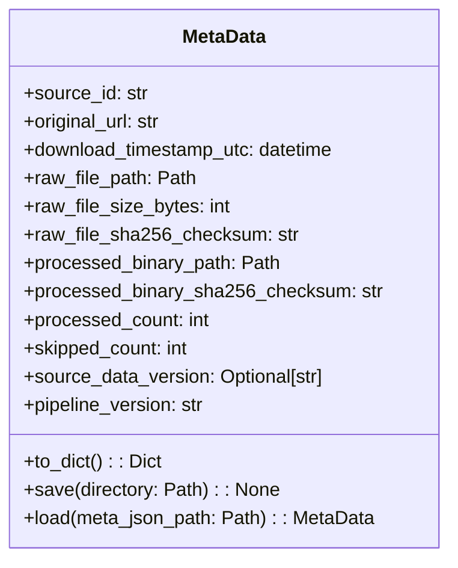

# ETL Data Management Strategy

This document outlines the recommended strategy for managing raw and processed data within the ETL pipeline, focusing on versioning, metadata tracking, and preventing redundant downloads.

## 1. Raw Data Versioning

To ensure traceability, reproducibility, and prevent data corruption, raw downloaded `json.gz` files will be versioned through a combination of checksums and systematic filename conventions.

*   **Checksums:** An SHA256 hash will be computed for every downloaded `json.gz` file immediately after download. This checksum will serve as a unique identifier for the file's content and will be stored in a companion `.sha256` file alongside the raw data.
    *   **Example:** `edsm_systems_20260208-120000.json.gz.sha256`
*   **Timestamp-based Filenames:** Raw filenames will incorporate the download timestamp (in UTC) to ensure uniqueness and provide chronological ordering.
    *   **Example:** `edsm_systems_20260208-120000.json.gz` (for a download on Feb 8, 2026, at 12:00:00 UTC).
    *   If the source provides a data version (e.g., in HTTP headers or API response), it may also be included: `edsm_systems_v1.2.3_20260208-120000.json.gz`.

## 2. Metadata Tracking

A dedicated `MetaData` Python class will encapsulate all relevant information about a specific raw data download and its subsequent processing run. Instances of this class will be serialized to a `meta.json` file alongside the raw data, acting as a decentralized registry.

### `MetaData` Class Structure


The `save(directory: Path)` method is responsible for serializing the `MetaData` object's state to a `meta.json` file within the specified directory.

### Component Interaction with `MetaData`

The `MetaData` object will be created and updated throughout the ETL process:

1.  **`ETLProcessor`**: Initiates a `MetaData` object at the start of an ETL run and passes it to the `Extractor`.
2.  **`Extractor`**: Responsible for filling in `original_url`, `download_timestamp_utc`, `raw_file_path`, `raw_file_size_bytes`, and `raw_file_sha256_checksum` after a successful download. **It also computes the SHA256 checksum of the raw downloaded `json.gz` file and writes this checksum to a companion `.sha256` file on disk.**
3.  **`ETLProcessor`**: After the download and raw checksum generation, the `ETLProcessor` will call `meta_data_object.save(download_directory)` to persist the `MetaData` object's current state to `meta.json`. It then passes the `raw_file_path` (obtained from the `MetaData` object) to the `Transformer`.
4.  **`Transformer`**: Processes the data from the `raw_file_path`. It reports `processed_count` and `skipped_count` back to the `ETLProcessor`.
5.  **`ETLProcessor`**: Updates the `MetaData` object with `processed_count`, `skipped_count`, `processed_binary_path`, and `processed_binary_sha256_checksum` (for the final output binary). The updated `MetaData` object is then saved again to `meta.json`.

## 3. Preventing Duplicate Downloads

To avoid unnecessary network traffic and disk usage, a check for previously downloaded data will occur before initiating a new download.

### Data Management Flow

```mermaid
graph TD
    A[Start ETL Process] --> B{Check for Recent Download?};
    B -- Yes (same URL, recent date) --> C[Skip Download & Reuse Existing];
    B -- No / Requires Update --> D[Extractor: Start Download];
    D --> E[Extractor: Compute Raw SHA256 & Write .sha256 File];
    E --> F[Extractor: Save raw_data.json.gz to Disk];
    F --> G[ETLProcessor: Create/Update MetaData Object];
    G --> H[MetaData: Save meta.json];
    H --> I[Continue ETL Pipeline (Transformer, Loader)];
    I --> J[ETLProcessor: Update MetaData with Processed Info];
    J --> K[MetaData: Update meta.json];
    K --> L[End ETL Process];
```

### Mechanism

1.  **Frequency Check:** The `ETLProcessor` (or `Extractor`) will first determine if a fresh download is needed based on a predefined frequency (e.g., once every 24 hours). This check will involve querying existing `meta.json` files for the last download time for a given `source_id` and `original_url`.
2.  **Remote Verification (if available):** If the external source provides `ETag` or `Last-Modified` headers in `HEAD` requests, these can be used to determine if the remote file has changed, avoiding a full download if the local copy is current.
3.  **Local Checksum Comparison:** After a new file is downloaded, its SHA256 checksum will be compared against previous downloads (if any) for the same source. If an identical file already exists, the newly downloaded duplicate can be discarded, and the path to the existing file can be used. This ensures only unique raw data versions are stored.