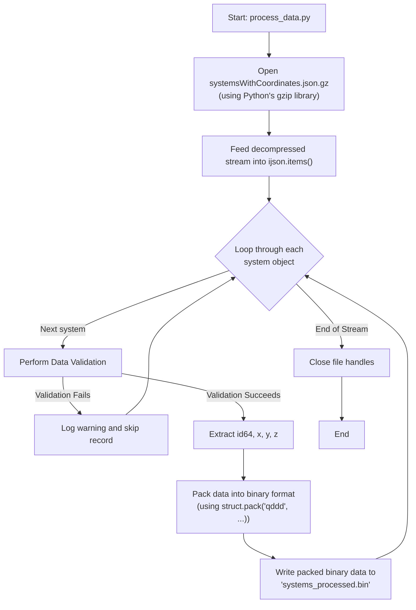

# ETL Process Deep Dive

This document provides a detailed technical breakdown of the ETL (Extract, Transform, Load) process implemented in the `process_data.py` script.

## 1. Data Conversion Workflow: From `json.gz` to `.bin`

This section details the step-by-step process of converting the raw, compressed EDSM data dump into our custom, high-performance binary format.

### Flowchart

### Step-by-Step Explanation

1.  **Open Compressed File:** The script opens the `systemsWithCoordinates.json.gz` file using Python's built-in `gzip` module in text mode (`'rt'`). This provides a file-like object that decompresses data on the fly as it's read.
2.  **Stream Parsing:** This decompressed stream is fed directly into the `ijson.items(f, 'item')` function. `ijson` acts as an iterator, yielding one complete system object at a time without ever loading the entire multi-gigabyte file into memory.
3.  **Iteration and Processing:** The script enters a loop, iterating through each system object provided by `ijson`.
4.  **Validation:** For each object, the validation logic (see below) is applied. If it fails, the object is skipped, and a warning is logged.
5.  **Extraction:** For valid objects, the script extracts the values from the required keys: `id64` and the `x`, `y`, and `z` values from the `coords` sub-object.
6.  **Binary Packing:** The extracted data is packed into a binary string using Python's `struct.pack()`. The format string `'qddd'` specifies the layout:
    *   `q`: `long long` (8 bytes) for `id64`.
    *   `d`: `double` (8 bytes) for `x`.
    *   `d`: `double` (8 bytes) for `y`.
    *   `d`: `double` (8 bytes) for `z`.
    This creates a compact 32-byte representation for each system.
7.  **Write to File:** This 32-byte binary string is written directly to the output file, `systems_processed.bin`.
8.  **Completion:** Once the `ijson` iterator is exhausted, the script closes both the input and output files, completing the process.

## 2. Data Validation Strategy

To ensure data integrity without sacrificing performance, the script performs fast, inline validation on every system object before processing.

*   **Presence Check:** It verifies that the keys `id64` and `coords` exist at the top level of the object. It also checks that `x`, `y`, and `z` exist within the `coords` object.
*   **Type Check:** It performs basic type checking to ensure `id64` is an integer-like value and that the coordinate values are numeric.
*   **Error Handling:** If any check fails, the record is considered malformed. It is not processed, and a warning message containing the system name (if available) and the reason for failure is logged.

## 3. Logging Strategy

A structured logging approach is used to provide insight into the pipeline's execution.

*   **Library:** Python's built-in `logging` module.
*   **Configuration:** The logger is configured to output messages to both the console (INFO level and above) and a rotating log file located at `pipeline/etl/logs/etl_process.log` (DEBUG level and above).
*   **Logged Events:**
    *   **INFO:** Start and end of the entire ETL process.
    *   **INFO:** File download status and progress.
    *   **INFO:** Final count of systems processed and skipped.
    *   **WARNING:** Details for each record that fails validation.
    *   **ERROR:** Any unhandled exceptions or critical failures (e.g., file not found, network error).
    *   **DEBUG:** More verbose information, such as progress updates every N records.
