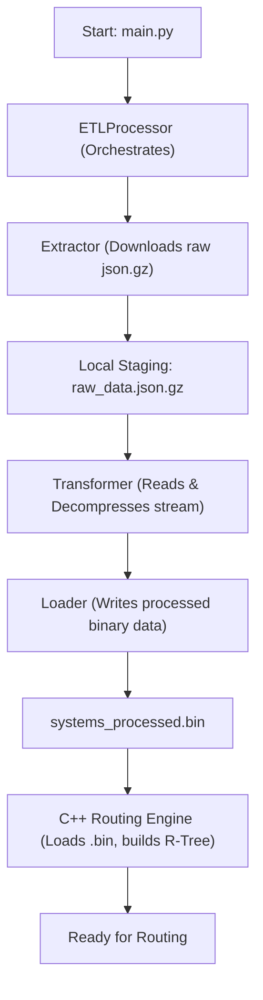
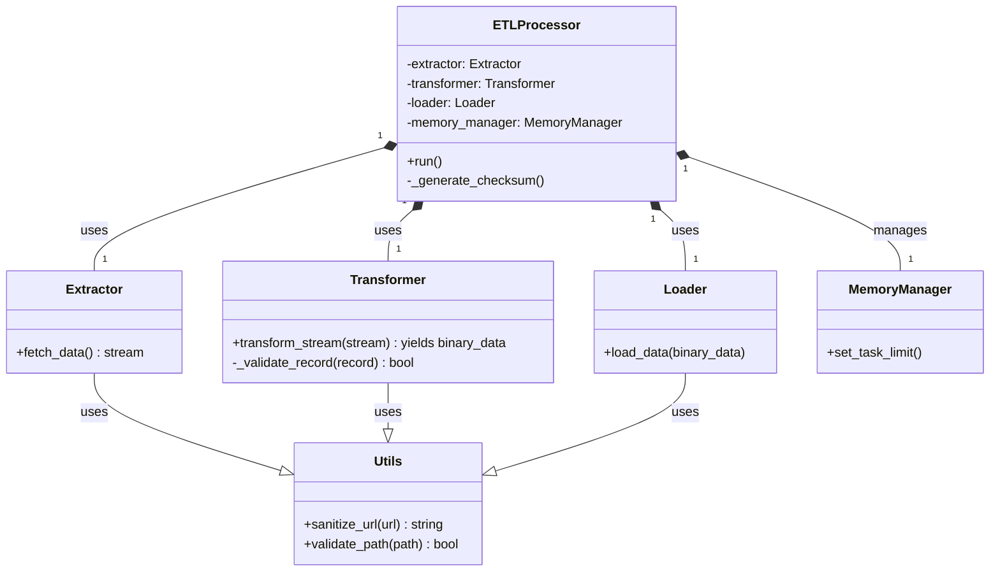

# ETL Process Deep Dive

This document provides a detailed technical breakdown of the ETL (Extract, Transform, Load) process implemented using a modular, class-based architecture. The pipeline is orchestrated by the `ETLProcessor` and utilizes `Extractor`, `Transformer`, and `Loader` components.

## 1. Data Conversion Workflow: From `json.gz` to `.bin`

This section details the step-by-step process of converting the raw, compressed EDSM data dump into our custom, high-performance binary format, incorporating robust data integrity checks, as handled by the new class structure.

### Flowchart



### Step-by-Step Explanation

The ETL process is orchestrated by the `ETLProcessor` class, which delegates specific tasks to `Extractor`, `Transformer`, and `Loader` components.

1.  **Orchestration (`ETLProcessor.run()`):** The `ETLProcessor` initiates the pipeline. It first ensures that the necessary output directories are in place and configures shared resources like the `MemoryManager`.
2.  **Data Extraction (`Extractor.fetch_data()`):** The `Extractor` component is responsible for:
    *   Sanitizing and validating the provided URL.
    *   Performing an HTTP GET request to the source (e.g., EDSM server) for the `systemsWithCoordinates.json.gz` file.
    *   Checking HTTP headers (`Content-Type`, `Content-Length`) to ensure the response is of the expected format and size.
    *   **Downloading the complete `json.gz` file to a local staging directory.**
    *   **Returning the path to the locally downloaded compressed file to the `ETLProcessor`.**
3.  **Data Transformation (`Transformer.transform_stream()`):** The `ETLProcessor` passes the **path to the locally downloaded `json.gz` file** received from the `Extractor` to the `Transformer`. The `Transformer` then opens this local file and performs the following steps:
    *   **Decompression:** Decompresses the gzipped stream in real-time as it reads from the local file.
    *   **Stream Parsing:** Utilizes `ijson` to parse the JSON stream, yielding one complete system object at a time without loading the entire dataset into memory.
    *   **Validation (`Transformer._validate_record()`):** For each streamed object, comprehensive validation logic is applied. This includes:
        *   **Presence Check:** Verifying that required keys (`id64`, `coords`, `x`, `y`, `z`) exist.
        *   **Type Check:** Ensuring correct data types for `id64` and coordinates.
        *   **Range Checks:** Validating coordinate values against known galactic bounds.
        *   If validation fails, the record is skipped, and a warning is logged.
    *   **Extraction:** For valid objects, the required values (`id64`, `x`, `y`, `z`) are extracted.
    *   **Binary Packing:** The extracted data is packed into a compact binary string (e.g., using `struct.pack('qddd', ...)`) for high-performance storage.
    *   The `Transformer` yields these packed binary chunks to the `ETLProcessor`.
4.  **Data Loading (`Loader.load_data()`):** The `ETLProcessor` receives the binary chunks from the `Transformer` and passes them to the `Loader`. The `Loader` is responsible for:
    *   Opening the target output file (`systems_processed.bin`) for writing.
    *   Writing the packed binary data directly to this file.
    *   Managing file handles and ensuring data is correctly persisted.
5.  **Completion and Checksums (`ETLProcessor._generate_checksum()`):** Once the `Transformer` has processed the entire stream, the `ETLProcessor` closes all file handles. It then triggers the generation of an SHA256 checksum for the final `systems_processed.bin` file and saves it to a `.sha256` file, ensuring end-to-end data integrity.

## 2. Data Validation Strategy

To ensure data integrity, the `Transformer` class performs comprehensive, inline validation on every system object during stream processing, within its `_validate_record` method.

*   **Presence Check:** It verifies that the keys `id64` and `coords` exist at the top level of the object. It also checks that `x`, `y`, and `z` exist within the `coords` object.
*   **Type Check:** It performs basic type checking to ensure `id64` is an integer-like value and that the coordinate values are numeric.
*   **Range Checks:** Crucially, it includes **range checks** on coordinate values (e.g., ensuring `x, y, z` are within known galactic bounds) to catch implausible or garbage values that might indicate data corruption or malformation.
*   **Error Handling:** If any check fails, the record is considered malformed. It is not processed, and a warning message containing the system name (if available) and the reason for failure is logged using the configured logging system.

## 3. Logging Strategy

A structured logging approach is used to provide insight into the pipeline's execution, managed by the `ETLProcessor` and its components.

*   **Library:** Python's built-in `logging` module.
*   **Configuration:** The logger is configured to output messages to both the console (INFO level and above) and a rotating log file located at `pipeline/etl/logs/etl_process.log` (DEBUG level and above).
*   **Logged Events:**
    *   **INFO:** Start and end of the entire ETL process, orchestrated by `ETLProcessor`.
    *   **INFO:** File download status, progress, and SHA256 verification results, reported by `Extractor`.
    *   **INFO:** Final count of systems processed and skipped, aggregated by `ETLProcessor`.
    *   **WARNING:** Details for each record that fails validation in `Transformer._validate_record`.
    *   **ERROR:** Any unhandled exceptions or critical failures (e.g., file not found, network error) from any component.
    *   **DEBUG:** More verbose information, such as progress updates every N records.

---

## 4. Data Integrity and Corruption Safeguards

To prevent corruption of `id64` and coordinate values, robust safeguards are implemented at multiple stages of the pipeline, with responsibilities distributed among the new class components.

### Stage 1: Download and Initial Verification (Extractor)

*   **Problem:** The source `json.gz` file could be corrupted during network transfer.
*   **Safeguard:**
    1.  The `Extractor.fetch_data()` method ensures the complete `json.gz` file is downloaded locally as a stream.
    2.  The `Extractor` performs integrity checks, such as verifying `Content-Type` and `Content-Length` headers.
    3.  Checksum verification against a source-provided checksum (if available) can be integrated within the `Extractor` or `ETLProcessor`.

### Stage 2: Transformation (Parsing & Validation - Transformer)

*   **Problem:** The source JSON may contain malformed records or unexpected data values.
*   **Safeguard:** The `Transformer._validate_record()` method performs robust checks on the streamed JSON records:
    *   **Presence and Type Checks:** Ensures all expected keys exist and their values are of the correct type.
    *   **Range Checks:** Validates coordinate values against known galactic boundaries, effectively filtering out corrupted or nonsensical entries. Records failing validation are logged and skipped.

### Stage 3: Binary Packing (Transformer)

*   **Problem:** Logical errors in the `struct.pack` implementation could corrupt data.
*   **Safeguard:** **Unit testing** is the primary guard here. Our test suite will compare the binary output of a sample dataset against a pre-calculated, byte-perfect `expected_output.bin` file, guaranteeing the packing logic within the `Transformer` is correct.

### Stage 4: End-to-End Integrity (Loader & ETLProcessor)

*   **Problem:** The final `.bin` file could be corrupted after it's created, or there could be a subtle issue missed by other checks.
*   **Safeguard:** The `ETLProcessor`, potentially with assistance from the `Loader`, computes an SHA256 hash of the final `systems_processed.bin` file and saves it to `systems_processed.bin.sha256`.
    *   When the C++ routing engine starts, it will first read the expected hash from the `.sha256` file. It will then compute the hash of the `.bin` file it's about to load. If the hashes do not match, the engine will refuse to load the data and exit with an error, preventing it from ever running with corrupted data.

---

## 5. ETL Script Design and Diagrams

To better structure the Python script and visualize the overall process, we use the following designs based on the new class architecture.

### Proposed Class Structure

The ETL pipeline is built around a modular, class-based design for robustness and testability.



### High-Level Component Interaction

This diagram shows the relationship and data flow between the major components of the ETL pipeline.

```mermaid
graph TD
    subgraph "External Source"
        A["cloud: EDSM Server"];
    end
    subgraph "Python ETL Pipeline"
        B(ETLProcessor);
        C[Extractor];
        D[Transformer];
        E[Loader];
        F[MemoryManager];
        G[Utils];
    end
    subgraph "Output Files"
        H["file: systems_processed.bin"];
        I["file: systems_processed.bin.sha256"];
    end
    subgraph "C++ Routing Engine"
        J["component: Routing Engine"];
    end

    A -- "HTTP Request" --> C;
    C -- "Raw Stream (json.gz)" --> B;
    B -- "Stream" --> D;
    D -- "Binary Chunks" --> B;
    B -- "Binary Chunks" --> E;
    E -- "Writes" --> H;
    B -- "Manages" --> F;
    C -- "Utilizes" --> G;
    D -- "Utilizes" --> G;
    E -- "Utilizes" --> G;
    B -- "Generates Checksum" --> I;
    H -- "Loads" --> J;
    I -- "Verifies" --> J;
``````