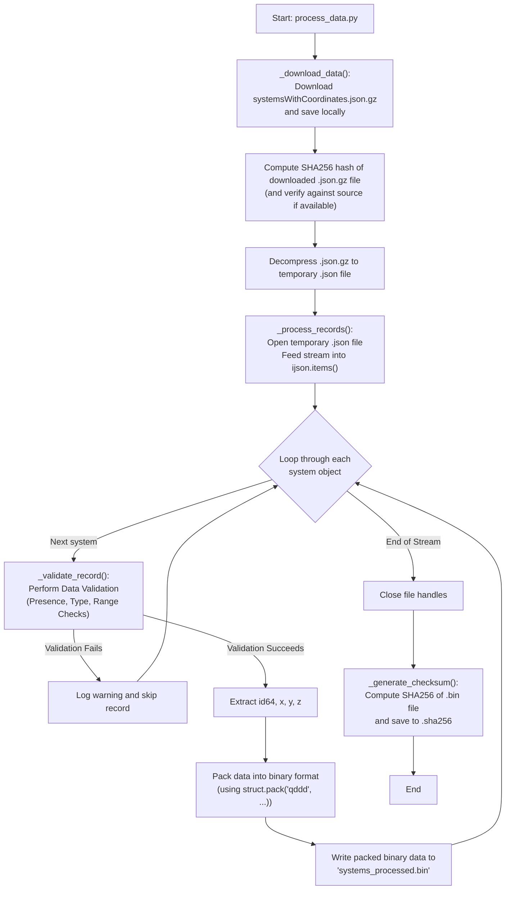
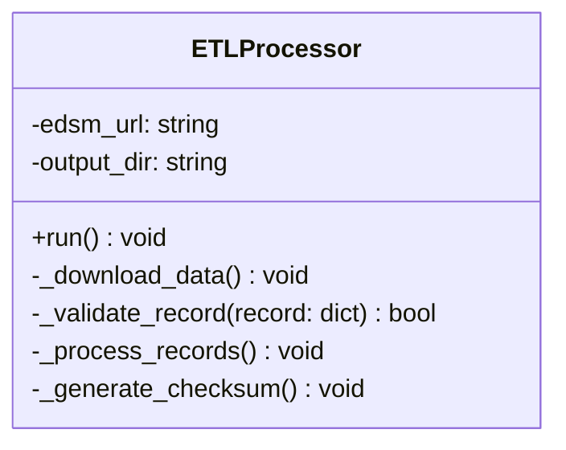

# ETL Process Deep Dive

This document provides a detailed technical breakdown of the ETL (Extract, Transform, Load) process implemented in the `process_data.py` script.

## 1. Data Conversion Workflow: From `json.gz` to `.bin`

This section details the step-by-step process of converting the raw, compressed EDSM data dump into our custom, high-performance binary format, incorporating robust data integrity checks.

### Flowchart



### Step-by-Step Explanation

1.  **Download and Save Compressed File:** The `_download_data()` method is responsible for fetching the `systemsWithCoordinates.json.gz` file from the EDSM server and saving it locally within the designated `output_dir`.
2.  **Verify Downloaded File Integrity:** Immediately after download, an SHA256 hash of the `json.gz` file is computed. If the EDSM source provides a reference checksum, this hash is verified against it to ensure the file was not corrupted during transfer. Even without a source checksum, this local hash can be used for future integrity checks.
3.  **Decompress to Temporary JSON:** The downloaded `json.gz` file is then decompressed into a temporary, uncompressed `.json` file. This intermediate step facilitates more flexible parsing and potential post-decompression validation.
4.  **Stream Parsing:** The `_process_records()` method opens the temporary `.json` file. This stream is fed into the `ijson.items(f, 'item')` function. `ijson` acts as an iterator, yielding one complete system object at a time without ever loading the entire multi-gigabyte file into memory.
5.  **Iteration and Processing:** The script enters a loop, iterating through each system object provided by `ijson`.
6.  **Validation:** For each object, the `_validate_record()` method applies comprehensive validation logic (see below). If validation fails, the object is skipped, and a warning is logged.
7.  **Extraction:** For valid objects, the script extracts the values from the required keys: `id64` and the `x`, `y`, and `z` values from the `coords` sub-object.
8.  **Binary Packing:** The extracted data is packed into a binary string using Python's `struct.pack()`. The format string `'qddd'` specifies the layout:
    *   `q`: `long long` (8 bytes) for `id64`.
    *   `d`: `double` (8 bytes) for `x`.
    *   `d`: `double` (8 bytes) for `y`.
    *   `d`: `double` (8 bytes) for `z`.
    This creates a compact 32-byte representation for each system.
9.  **Write to File:** This 32-byte binary string is written directly to the output file, `systems_processed.bin`.
10. **Completion and Checksum:** Once the `ijson` iterator is exhausted, the script closes both the input and output files. The `_generate_checksum()` method is then called to compute and save the SHA256 hash of the final `systems_processed.bin` file to `systems_processed.bin.sha256`, completing the process.

## 2. Data Validation Strategy

To ensure data integrity, the `_validate_record` method performs comprehensive, inline validation on every system object before processing.

*   **Presence Check:** It verifies that the keys `id64` and `coords` exist at the top level of the object. It also checks that `x`, `y`, and `z` exist within the `coords` object.
*   **Type Check:** It performs basic type checking to ensure `id64` is an integer-like value and that the coordinate values are numeric.
*   **Range Checks:** Crucially, it includes **range checks** on coordinate values (e.g., ensuring `x, y, z` are within known galactic bounds) to catch implausible or garbage values that might indicate data corruption or malformation.
*   **Error Handling:** If any check fails, the record is considered malformed. It is not processed, and a warning message containing the system name (if available) and the reason for failure is logged using the configured logging system.

## 3. Logging Strategy

A structured logging approach is used to provide insight into the pipeline's execution.

*   **Library:** Python's built-in `logging` module.
*   **Configuration:** The logger is configured to output messages to both the console (INFO level and above) and a rotating log file located at `pipeline/etl/logs/etl_process.log` (DEBUG level and above).
*   **Logged Events:**
    *   **INFO:** Start and end of the entire ETL process.
    *   **INFO:** File download status, progress, and SHA256 verification results.
    *   **INFO:** Final count of systems processed and skipped.
    *   **WARNING:** Details for each record that fails validation in `_validate_record`.
    *   **ERROR:** Any unhandled exceptions or critical failures (e.g., file not found, network error).
    *   **DEBUG:** More verbose information, such as progress updates every N records.

---

## 4. Data Integrity and Corruption Safeguards

To prevent corruption of `id64` and coordinate values, robust safeguards are implemented at multiple stages of the pipeline.

### Stage 1: Download and Initial Verification

*   **Problem:** The source `json.gz` file could be corrupted during network transfer.
*   **Safeguard:**
    1.  The `_download_data()` method ensures the complete `json.gz` file is downloaded locally.
    2.  An SHA256 hash is computed for this downloaded `json.gz` file. If the source provides a checksum, this is verified to guarantee integrity from the origin.
    3.  The `json.gz` file is then fully decompressed to a temporary `.json` file, serving as an additional integrity check on the compression format.
    4.  Optional: Further validation can be performed on the raw `.json` file, such as schema validation if a formal schema is defined.

### Stage 2: Transformation (Parsing & Validation)

*   **Problem:** The source JSON may contain malformed records or unexpected data values.
*   **Safeguard:** The `_validate_record()` method performs robust checks:
    *   **Presence and Type Checks:** Ensures all expected keys exist and their values are of the correct type.
    *   **Range Checks:** Validates coordinate values against known galactic boundaries, effectively filtering out corrupted or nonsensical entries. Records failing validation are logged and skipped.

### Stage 3: Binary Packing

*   **Problem:** Logical errors in the `struct.pack` implementation could corrupt data.
*   **Safeguard:** **Unit testing** is the primary guard here. Our test suite will compare the binary output of a sample dataset against a pre-calculated, byte-perfect `expected_output.bin` file, guaranteeing the packing logic is correct.

### Stage 4: End-to-End Integrity

*   **Problem:** The final `.bin` file could be corrupted after it's created, or there could be a subtle issue missed by other checks.
*   **Safeguard:** The `_generate_checksum()` method computes an SHA256 hash of the final `systems_processed.bin` file and saves it to `systems_processed.bin.sha256`.
    *   When the C++ routing engine starts, it will first read the expected hash from the `.sha256` file. It will then compute the hash of the `.bin` file it's about to load. If the hashes do not match, the engine will refuse to load the data and exit with an error, preventing it from ever running with corrupted data.

---

## 5. ETL Script Design and Diagrams

To better structure the Python script and visualize the overall process, we can use the following designs.

### Proposed Class Structure

While the initial script can be procedural, a more robust and testable implementation would be to encapsulate the logic in a class.



### High-Level Component Interaction

This diagram shows the relationship between the major components of the V1 pipeline.

```mermaid
graph TD
    subgraph "External Source"
        A["cloud: EDSM Server"];
    end
    subgraph "Python ETL Pipeline"
        B["component: ETLProcessor"];
        C["file: downloaded.json.gz"];
        D["file: temp.json (decompressed)"];
        E["database: systems_processed.bin"];
        F["artifact: systems_processed.bin.sha256"];
    end
    subgraph "C++ Routing Engine"
        G["component: Routing Engine"];
    end

    A -- "downloads" --> B;
    B -- "saves" --> C;
    B -- "decompresses" --> D;
    B -- "reads from" --> D;
    B -- "writes" --> E;
    B -- "writes" --> F;
    E -- "is read by" --> G;
    F -- "is read by" --> G;
``````