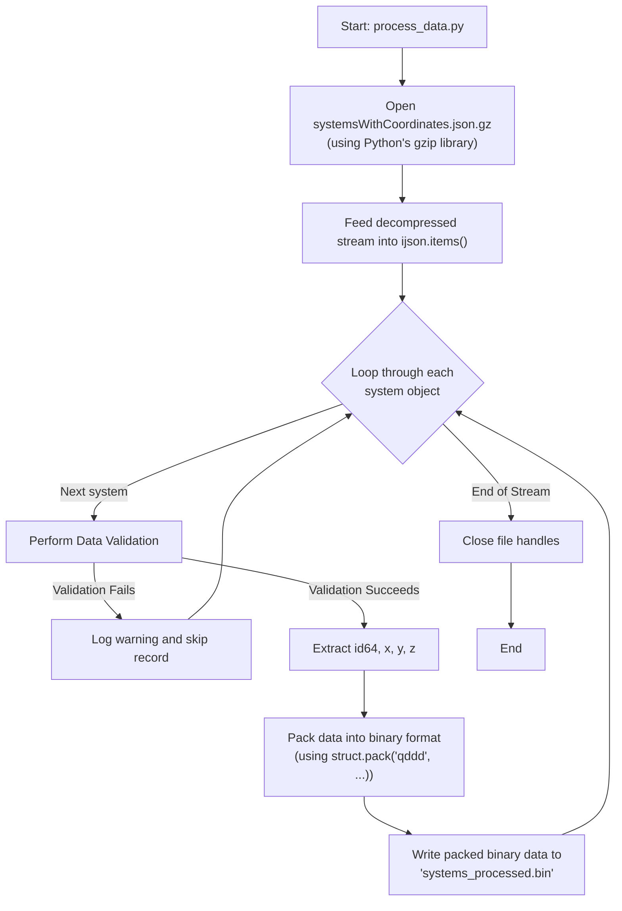
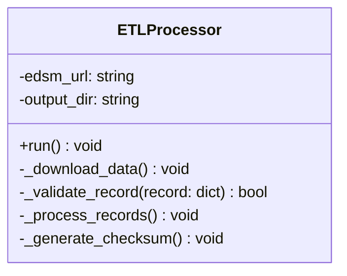
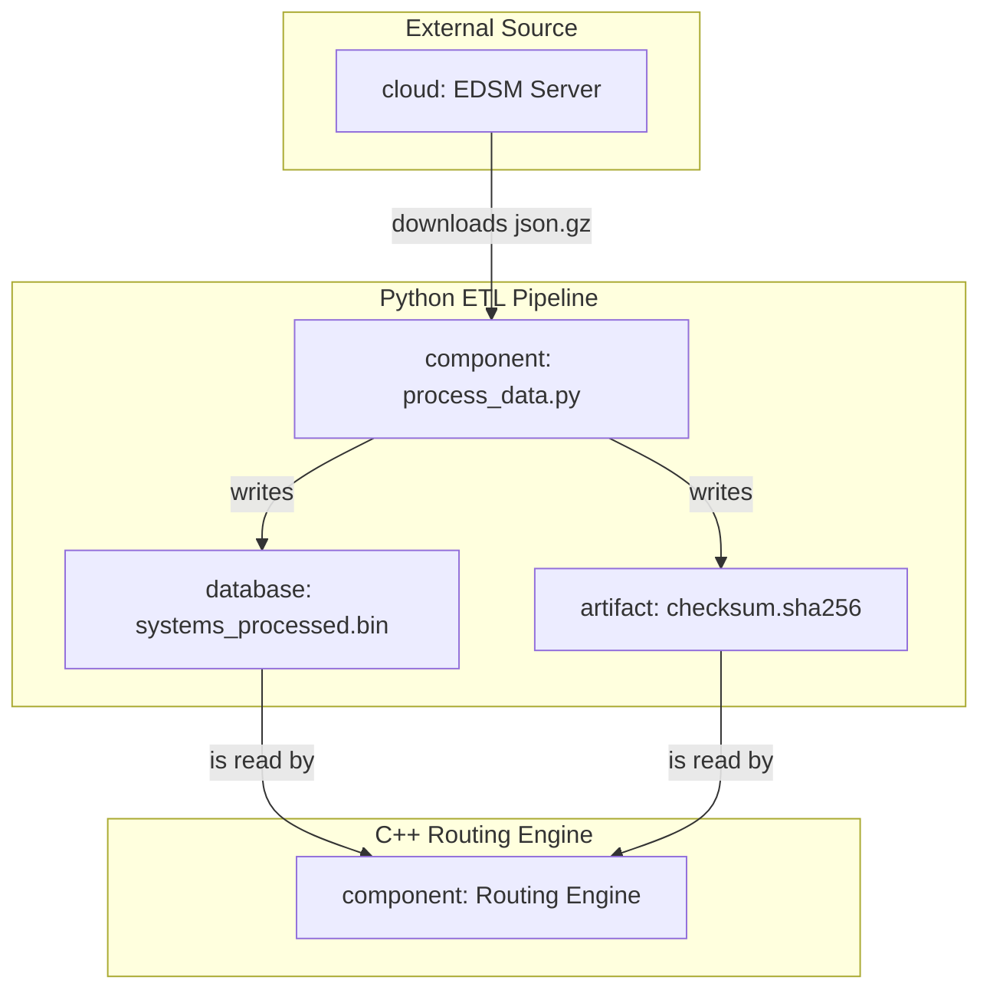

# ETL Process Deep Dive

This document provides a detailed technical breakdown of the ETL (Extract, Transform, Load) process implemented in the `process_data.py` script.

## 1. Data Conversion Workflow: From `json.gz` to `.bin`

This section details the step-by-step process of converting the raw, compressed EDSM data dump into our custom, high-performance binary format.

### Flowchart

### Step-by-Step Explanation

1.  **Open Compressed File:** The script opens the `systemsWithCoordinates.json.gz` file using Python's built-in `gzip` module in text mode (`'rt'`). This provides a file-like object that decompresses data on the fly as it's read.
2.  **Stream Parsing:** This decompressed stream is fed directly into the `ijson.items(f, 'item')` function. `ijson` acts as an iterator, yielding one complete system object at a time without ever loading the entire multi-gigabyte file into memory.
3.  **Iteration and Processing:** The script enters a loop, iterating through each system object provided by `ijson`.
4.  **Validation:** For each object, the validation logic (see below) is applied. If it fails, the object is skipped, and a warning is logged.
5.  **Extraction:** For valid objects, the script extracts the values from the required keys: `id64` and the `x`, `y`, and `z` values from the `coords` sub-object.
6.  **Binary Packing:** The extracted data is packed into a binary string using Python's `struct.pack()`. The format string `'qddd'` specifies the layout:
    *   `q`: `long long` (8 bytes) for `id64`.
    *   `d`: `double` (8 bytes) for `x`.
    *   `d`: `double` (8 bytes) for `y`.
    *   `d`: `double` (8 bytes) for `z`.
    This creates a compact 32-byte representation for each system.
7.  **Write to File:** This 32-byte binary string is written directly to the output file, `systems_processed.bin`.
8.  **Completion:** Once the `ijson` iterator is exhausted, the script closes both the input and output files, completing the process.

## 2. Data Validation Strategy

To ensure data integrity without sacrificing performance, the script performs fast, inline validation on every system object before processing.

*   **Presence Check:** It verifies that the keys `id64` and `coords` exist at the top level of the object. It also checks that `x`, `y`, and `z` exist within the `coords` object.
*   **Type Check:** It performs basic type checking to ensure `id64` is an integer-like value and that the coordinate values are numeric.
*   **Error Handling:** If any check fails, the record is considered malformed. It is not processed, and a warning message containing the system name (if available) and the reason for failure is logged.

## 3. Logging Strategy

A structured logging approach is used to provide insight into the pipeline's execution.

*   **Library:** Python's built-in `logging` module.
*   **Configuration:** The logger is configured to output messages to both the console (INFO level and above) and a rotating log file located at `pipeline/etl/logs/etl_process.log` (DEBUG level and above).
*   **Logged Events:**
    *   **INFO:** Start and end of the entire ETL process.
    *   **INFO:** File download status and progress.
    *   **INFO:** Final count of systems processed and skipped.
    *   **WARNING:** Details for each record that fails validation.
    *   **ERROR:** Any unhandled exceptions or critical failures (e.g., file not found, network error).
    *   **DEBUG:** More verbose information, such as progress updates every N records.

---

## 4. Data Integrity and Corruption Safeguards

To prevent corruption of `id64` and coordinate values, safeguards are implemented at multiple stages of the pipeline.

### Stage 1: Download

*   **Problem:** The source `json.gz` file could be corrupted during network transfer.
*   **Safeguard:** The successful decompression by Python's `gzip` library serves as a basic integrity check on the compressed file. More advanced checks, like comparing against a source-provided checksum (e.g., SHA256), will be implemented if the data source provides them.

### Stage 2: Transformation (Parsing & Validation)

*   **Problem:** The source JSON may contain malformed records.
*   **Safeguard:** In addition to the presence and type checks in the main validation strategy, we will implement **range checks** on coordinates (e.g., ensuring `x, y, z` are within known galactic bounds) to catch garbage values.

### Stage 3: Binary Packing

*   **Problem:** Logical errors in the `struct.pack` implementation could corrupt data.
*   **Safeguard:** **Unit testing** is the primary guard here. Our test suite will compare the binary output of a sample dataset against a pre-calculated, byte-perfect `expected_output.bin` file, guaranteeing the packing logic is correct.

### Stage 4: End-to-End Integrity

*   **Problem:** The final `.bin` file could be corrupted after it's created, or there could be a subtle issue missed by other checks.
*   **Safeguard:** We will implement an **end-to-end checksum verification**:
    1.  After `process_data.py` successfully creates the `systems_processed.bin` file, it will compute a SHA256 hash of the file and save it to `systems_processed.bin.sha256`.
    2.  When the C++ routing engine starts, it will first read the expected hash from the `.sha256` file. It will then compute the hash of the `.bin` file it's about to load. If the hashes do not match, the engine will refuse to load the data and exit with an error, preventing it from ever running with corrupted data.

---

## 5. ETL Script Design and Diagrams

To better structure the Python script and visualize the overall process, we can use the following designs.

### Proposed Class Structure

While the initial script can be procedural, a more robust and testable implementation would be to encapsulate the logic in a class.

### High-Level Component Interaction

This diagram shows the relationship between the major components of the V1 pipeline.

