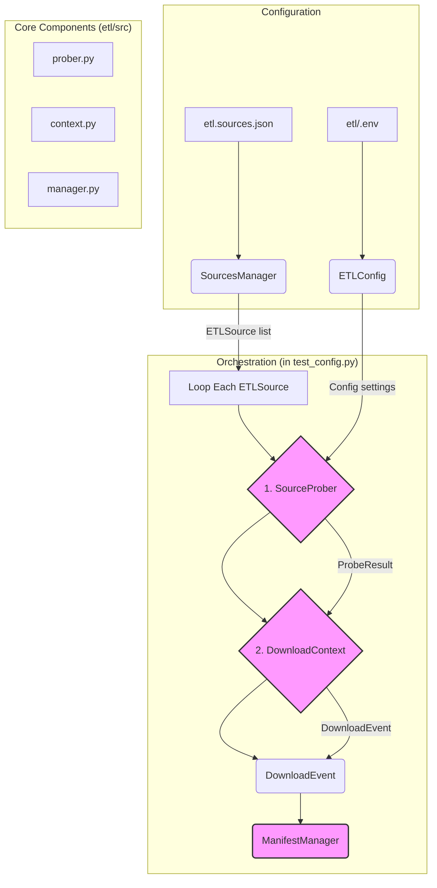

# ETL Component Architecture

This document provides a high-level overview of the "as-built" architecture for the `etl` component. The system is designed as a modular, file-based extraction pipeline that probes remote data sources, downloads them efficiently, and records the results.

The orchestration logic is currently defined in `etl/tests/test_config.py`, which serves as the reference implementation for how the components interact.

## 1. High-Level Component Diagram

This diagram illustrates the main components of the application and the flow of data between them.

## 2. Core Components & Responsibilities

The application is built from several key modules that each have a distinct responsibility.

-   **ETLConfig (`src/config/model.py`):**
    A Pydantic-based settings model that loads all configuration from a `.env` file and environment variables. It acts as a central provider of settings (paths, timeouts, feature flags) to all other components.

-   **SourcesManager (`src/extractor/sources/source_manager.py`):**
    Responsible for loading the list of data sources to be processed from a JSON file (e.g., `etl.sources.json`). It parses this file and returns a list of `ETLSource` data models.

-   **SourceProber (`src/extractor/source_probe/prober.py`):**
    Acts as the "scout." Before any download, it performs a lightweight check on the remote URL. It sends a `HEAD` request to get headers (like ETag and Last-Modified) and a partial `GET` request to sample the file's content, determining its MIME type using "magic byte" analysis. It returns a `ProbeResult` object.

-   **DownloadContext (`src/extractor/download/context.py`):**
    The main entry point for the download process. It uses a **Strategy Pattern** to select a specific download "regime" (e.g., `GzipRegime`) based on the MIME type reported by the `SourceProber`. It manages the download stream, calculates the checksum, and returns a `DownloadEvent` upon completion.

-   **ManifestManager (`src/common/manifests/manager.py`):**
    The state-tracking system. It provides access to `Manifest` instances (e.g., for `extractor`), which are responsible for loading and saving a JSON manifest file. The manifest records metadata about each successful download, keyed by the file's SHA-256 checksum. *(Note: In the current implementation shown in `test_config.py`, this component is initialized but not yet fully integrated into the orchestration loop).*

## 3. Data Flow

The pipeline operates by passing immutable Pydantic data models between the core components.

1.  **Start:** The process begins by loading `ETLConfig` and using `SourcesManager` to get a list of `ETLSource` objects.
2.  **Probing:** For each `ETLSource`, the `SourceProber` is given a URL. It returns a `ProbeResult` containing metadata about the remote file.
3.  **Downloading:** The `DownloadContext` receives the `ProbeResult` and `ETLSource`. It selects a strategy, performs the download, and returns a `DownloadEvent`.
4.  **Recording (Intended):** The `DownloadEvent` is intended to be passed to the `ManifestManager` to create a `ManifestRecord`, creating a permanent log of the successful download.

This modular, data-centric flow ensures that each component has a clear and testable responsibility.
